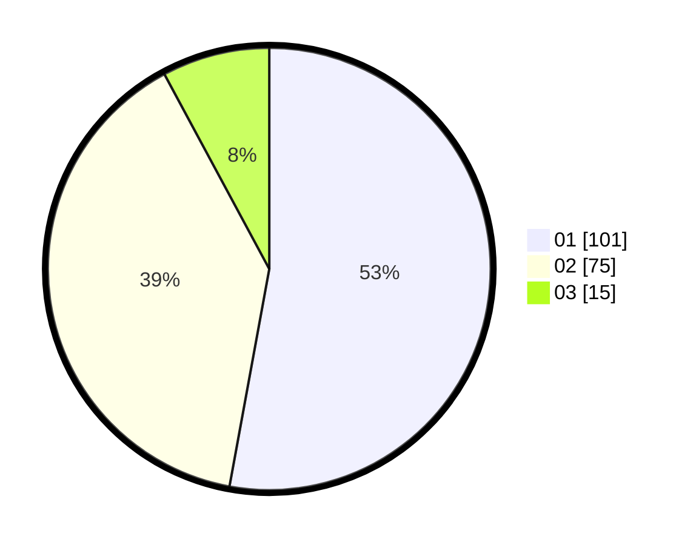

# Hasil

Hasil perolehan suara paslon dapat dilihat pada file paslon-01.txt, paslon-02.txt, dan paslon-03.txt.

Jika tidak ada, artinya data tersebut belum ada pada SIREKAP.

## Perolehan Suara

 * Paslon 01: **101**.
 * Paslon 02: **75**.
 * Paslon 03: **15**.

## Foto C Plano

https://sirekap-obj-formc.kpu.go.id/77fe/pemilu/ppwp/31/71/03/10/04/3171031004065-20240215-002824--d61c5d3c-c5c2-42d2-8ba2-93b94033ede8.jpg

https://sirekap-obj-formc.kpu.go.id/77fe/pemilu/ppwp/31/71/03/10/04/3171031004065-20240216-160905--3a12acbc-2ed0-48bc-a995-97d44165747d.jpg
