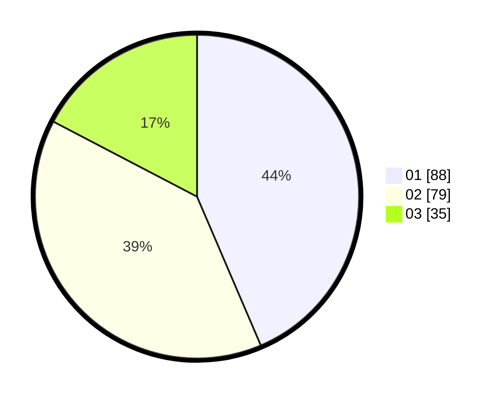

# Hasil

Hasil perolehan suara paslon dapat dilihat pada file paslon-01.txt, paslon-02.txt, dan paslon-03.txt.

Jika tidak ada, artinya data tersebut belum ada pada SIREKAP.

## Perolehan Suara

 * Paslon 01: **88**.
 * Paslon 02: **79**.
 * Paslon 03: **35**.

## Foto C Plano

https://sirekap-obj-formc.kpu.go.id/1d88/pemilu/ppwp/31/71/03/10/04/3171031004068-20240214-214403--f5a30a1b-c609-4c6b-a6dc-a7b0ab7f2b9f.jpg

https://sirekap-obj-formc.kpu.go.id/1d88/pemilu/ppwp/31/71/03/10/04/3171031004068-20240214-214254--6ad05c6d-d6a8-4375-9159-748dea396ad2.jpg

https://sirekap-obj-formc.kpu.go.id/1d88/pemilu/ppwp/31/71/03/10/04/3171031004068-20240214-214332--cbe54f1b-4c21-429e-94b4-aed7a8aeddf4.jpg

## DATA PEMILIH TETAP

Jumlah pemilih dalam DPT: **280**.
 * L: **136**.
 * P: **144**.

## DATA PENGGUNA HAK PILIH

Jumlah pengguna hak pilih dalam DPT: **201**.
 * L: **96**.
 * P: **105**.

Jumlah pengguna hak pilih dalam DPTb: **4**.
 * L: **2**.
 * P: **2**.

Jumlah pengguna hak pilih dalam DPK: **0**.
 * L: **0**.
 * P: **0**.

Jumlah pengguna hak pilih: **205**.
 * L: **98**.
 * P: **107**.

## JUMLAH SUARA SAH DAN TIDAK SAH

JUMLAH SELURUH SUARA SAH: **202**.

JUMLAH SUARA TIDAK SAH: **3**.

JUMLAH SELURUH SUARA SAH DAN SUARA TIDAK SAH: **205**.
