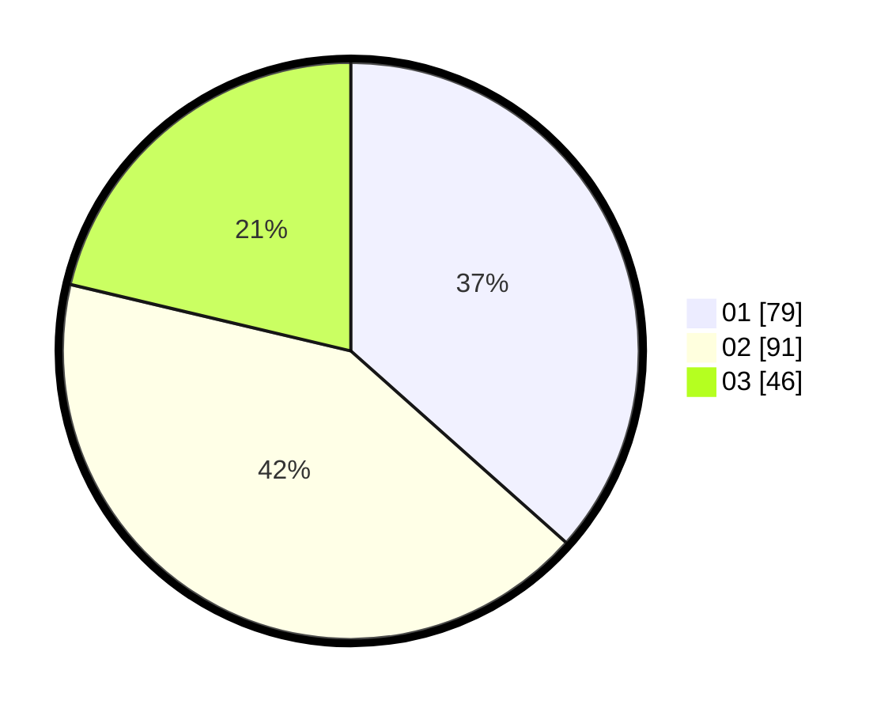

# Hasil

Hasil perolehan suara paslon dapat dilihat pada file paslon-01.txt, paslon-02.txt, dan paslon-03.txt.

Jika tidak ada, artinya data tersebut belum ada pada SIREKAP.

## Perolehan Suara

 * Paslon 01: **79**.
 * Paslon 02: **91**.
 * Paslon 03: **46**.

## Foto C Plano

https://sirekap-obj-formc.kpu.go.id/3ab5/pemilu/ppwp/31/71/03/10/04/3171031004069-20240217-094235--93dada2a-6c94-456c-b1bd-3495a12f2888.jpg

https://sirekap-obj-formc.kpu.go.id/3ab5/pemilu/ppwp/31/71/03/10/04/3171031004069-20240217-094237--a4b29e4f-c672-4800-b84d-6f215094c5b6.jpg

https://sirekap-obj-formc.kpu.go.id/3ab5/pemilu/ppwp/31/71/03/10/04/3171031004069-20240217-094236--21042f8f-d388-406a-977d-ba8e666b4c15.jpg

## DATA PEMILIH TETAP

Jumlah pemilih dalam DPT: **279**.
 * L: **138**.
 * P: **141**.

## DATA PENGGUNA HAK PILIH

Jumlah pengguna hak pilih dalam DPT: **217**.
 * L: **104**.
 * P: **113**.

Jumlah pengguna hak pilih dalam DPTb: **2**.
 * L: **1**.
 * P: **1**.

Jumlah pengguna hak pilih dalam DPK: **4**.
 * L: **2**.
 * P: **2**.

Jumlah pengguna hak pilih: **223**.
 * L: **107**.
 * P: **116**.

## JUMLAH SUARA SAH DAN TIDAK SAH

JUMLAH SELURUH SUARA SAH: **216**.

JUMLAH SUARA TIDAK SAH: **7**.

JUMLAH SELURUH SUARA SAH DAN SUARA TIDAK SAH: **223**.
