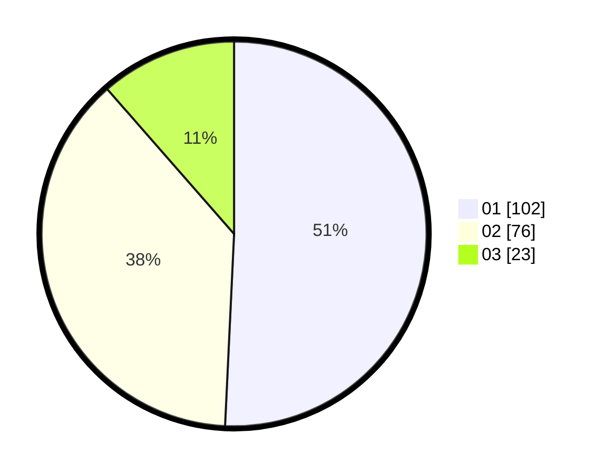

# Hasil

Hasil perolehan suara paslon dapat dilihat pada file paslon-01.txt, paslon-02.txt, dan paslon-03.txt.

Jika tidak ada, artinya data tersebut belum ada pada SIREKAP.

## Perolehan Suara

 * Paslon 01: **102**.
 * Paslon 02: **76**.
 * Paslon 03: **23**.

## Foto C Plano

https://sirekap-obj-formc.kpu.go.id/c9c6/pemilu/ppwp/31/71/03/10/04/3171031004076-20240214-155837--997ef31a-919c-4337-a7d1-d85cbaa3dcda.jpg

https://sirekap-obj-formc.kpu.go.id/c9c6/pemilu/ppwp/31/71/03/10/04/3171031004076-20240214-160058--902d5273-e55f-4de4-ab64-aeb89442256d.jpg
