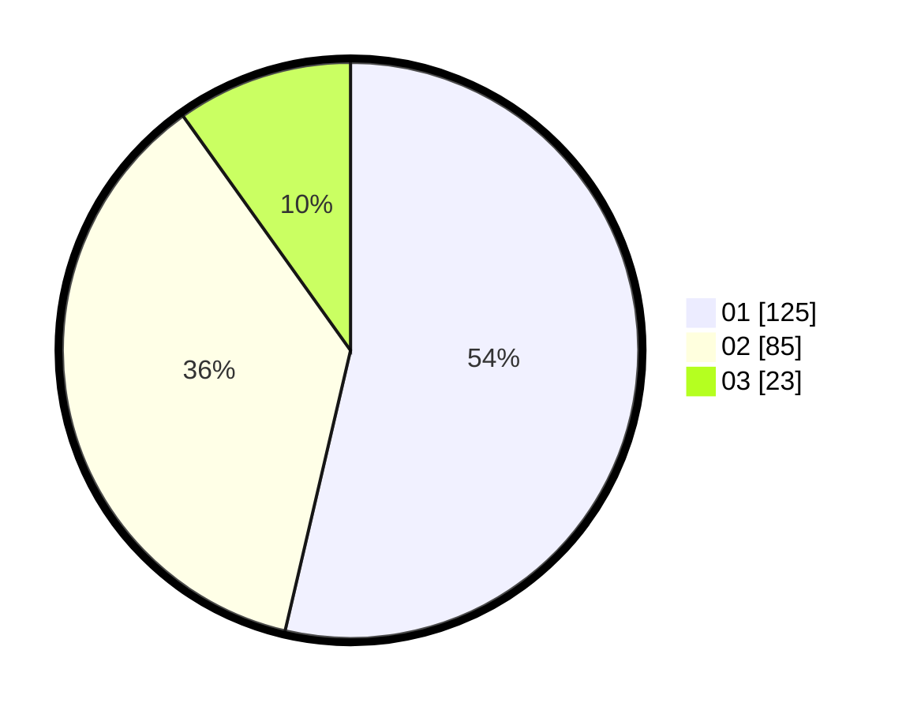

# Hasil

Hasil perolehan suara paslon dapat dilihat pada file paslon-01.txt, paslon-02.txt, dan paslon-03.txt.

Jika tidak ada, artinya data tersebut belum ada pada SIREKAP.

## Perolehan Suara

 * Paslon 01: **125**.
 * Paslon 02: **85**.
 * Paslon 03: **23**.

## Foto C Plano

https://sirekap-obj-formc.kpu.go.id/f421/pemilu/ppwp/31/71/03/10/04/3171031004084-20240214-202119--da9bf065-9eef-42d4-848f-38a239ed8af5.jpg

https://sirekap-obj-formc.kpu.go.id/f421/pemilu/ppwp/31/71/03/10/04/3171031004084-20240214-202309--f63b35e2-f6d4-4c64-b061-ff94ac65d3de.jpg

https://sirekap-obj-formc.kpu.go.id/f421/pemilu/ppwp/31/71/03/10/04/3171031004084-20240214-202412--f619426c-8949-4a2b-8e59-4f7e04f22b84.jpg

## DATA PEMILIH TETAP

Jumlah pemilih dalam DPT: **235**.
 * L: **107**.
 * P: **128**.

## DATA PENGGUNA HAK PILIH

Jumlah pengguna hak pilih dalam DPT: **230**.
 * L: **105**.
 * P: **125**.

Jumlah pengguna hak pilih dalam DPTb: **0**.
 * L: **0**.
 * P: **0**.

Jumlah pengguna hak pilih dalam DPK: **5**.
 * L: **2**.
 * P: **3**.

Jumlah pengguna hak pilih: **235**.
 * L: **107**.
 * P: **128**.

## JUMLAH SUARA SAH DAN TIDAK SAH

JUMLAH SELURUH SUARA SAH: **233**.

JUMLAH SUARA TIDAK SAH: **2**.

JUMLAH SELURUH SUARA SAH DAN SUARA TIDAK SAH: **235**.
