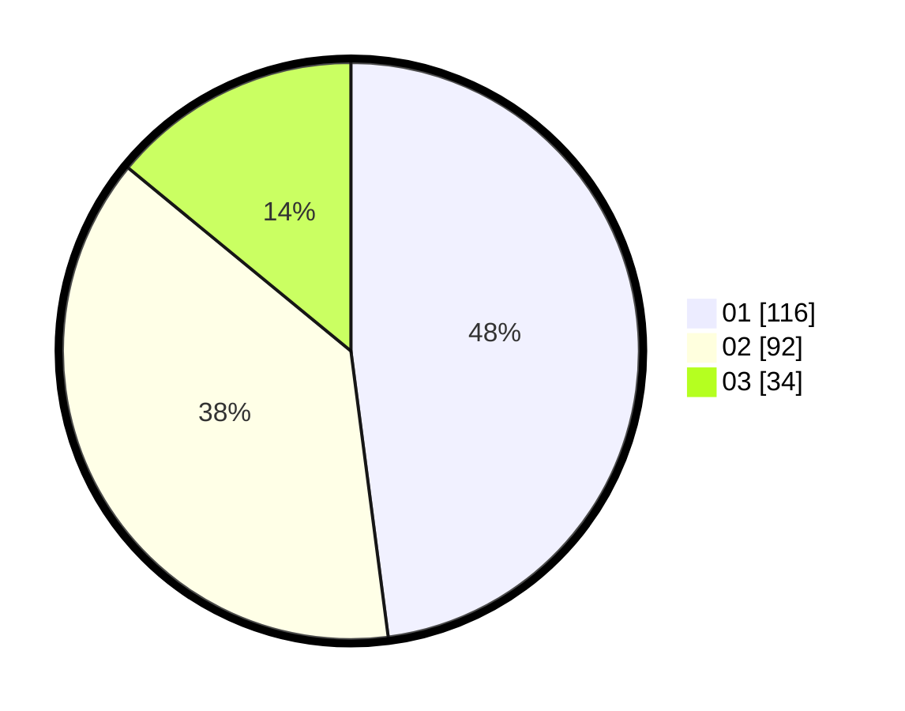

# Hasil

Hasil perolehan suara paslon dapat dilihat pada file paslon-01.txt, paslon-02.txt, dan paslon-03.txt.

Jika tidak ada, artinya data tersebut belum ada pada SIREKAP.

## Perolehan Suara

 * Paslon 01: **116**.
 * Paslon 02: **92**.
 * Paslon 03: **34**.

## Foto C Plano

https://sirekap-obj-formc.kpu.go.id/cdc8/pemilu/ppwp/31/71/03/10/04/3171031004086-20240214-214157--24f159bb-3e64-4912-9080-8b1c7c4369b1.jpg

https://sirekap-obj-formc.kpu.go.id/cdc8/pemilu/ppwp/31/71/03/10/04/3171031004086-20240214-214215--952900fa-f4fd-40f5-8bc5-e7bd2a17f7eb.jpg

https://sirekap-obj-formc.kpu.go.id/cdc8/pemilu/ppwp/31/71/03/10/04/3171031004086-20240214-214236--7a48aec0-2e60-479b-a239-c510261f9ddd.jpg
