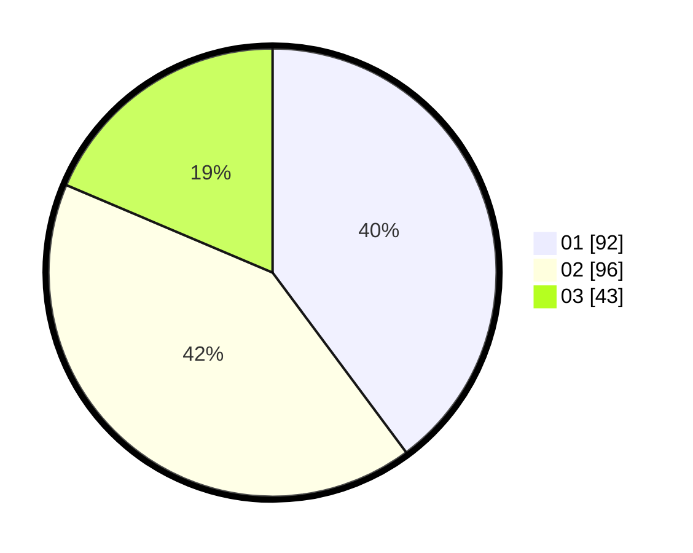

# Hasil

Hasil perolehan suara paslon dapat dilihat pada file paslon-01.txt, paslon-02.txt, dan paslon-03.txt.

Jika tidak ada, artinya data tersebut belum ada pada SIREKAP.

## Perolehan Suara

 * Paslon 01: **92**.
 * Paslon 02: **96**.
 * Paslon 03: **43**.

## Foto C Plano

https://sirekap-obj-formc.kpu.go.id/93e4/pemilu/ppwp/31/71/03/10/04/3171031004090-20240216-011012--535e78f3-7c85-4754-b41f-9be4dec8a192.jpg

https://sirekap-obj-formc.kpu.go.id/93e4/pemilu/ppwp/31/71/03/10/04/3171031004090-20240216-011013--e9fbafea-1d1f-40d6-8d97-269dbb727a09.jpg

https://sirekap-obj-formc.kpu.go.id/93e4/pemilu/ppwp/31/71/03/10/04/3171031004090-20240214-192445--4e97fd78-48a3-4e4d-b0ab-9ad489d869ff.jpg

## DATA PEMILIH TETAP

Jumlah pemilih dalam DPT: **284**.
 * L: **144**.
 * P: **140**.

## DATA PENGGUNA HAK PILIH

Jumlah pengguna hak pilih dalam DPT: **226**.
 * L: **109**.
 * P: **117**.

Jumlah pengguna hak pilih dalam DPTb: **2**.
 * L: **0**.
 * P: **2**.

Jumlah pengguna hak pilih dalam DPK: **7**.
 * L: **4**.
 * P: **3**.

Jumlah pengguna hak pilih: **235**.
 * L: **113**.
 * P: **122**.

## JUMLAH SUARA SAH DAN TIDAK SAH

JUMLAH SELURUH SUARA SAH: **231**.

JUMLAH SUARA TIDAK SAH: **4**.

JUMLAH SELURUH SUARA SAH DAN SUARA TIDAK SAH: **235**.
