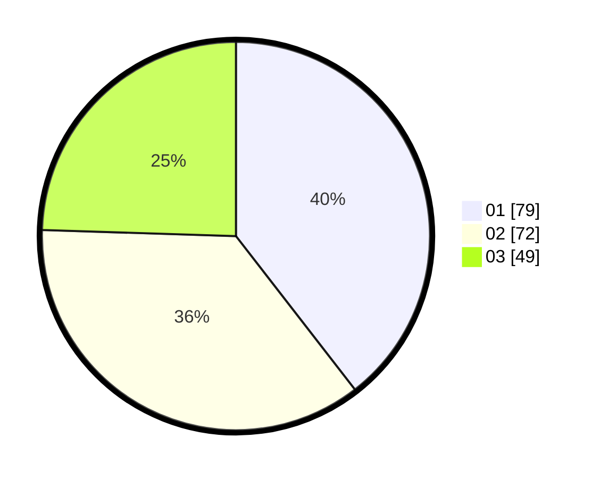

# Hasil

Hasil perolehan suara paslon dapat dilihat pada file paslon-01.txt, paslon-02.txt, dan paslon-03.txt.

Jika tidak ada, artinya data tersebut belum ada pada SIREKAP.

## Perolehan Suara

 * Paslon 01: **79**.
 * Paslon 02: **72**.
 * Paslon 03: **49**.

## Foto C Plano

https://sirekap-obj-formc.kpu.go.id/4d6c/pemilu/ppwp/31/71/03/10/04/3171031004094-20240214-195713--76c2d77d-d21e-45c1-9b82-0b0b4e71e3e2.jpg

https://sirekap-obj-formc.kpu.go.id/4d6c/pemilu/ppwp/31/71/03/10/04/3171031004094-20240214-195812--4e3ac813-f5bf-4df9-8c19-c0e62e6cd46b.jpg

https://sirekap-obj-formc.kpu.go.id/4d6c/pemilu/ppwp/31/71/03/10/04/3171031004094-20240214-195922--da4ac2b1-73b3-498a-9dee-22da0bd9b20d.jpg
