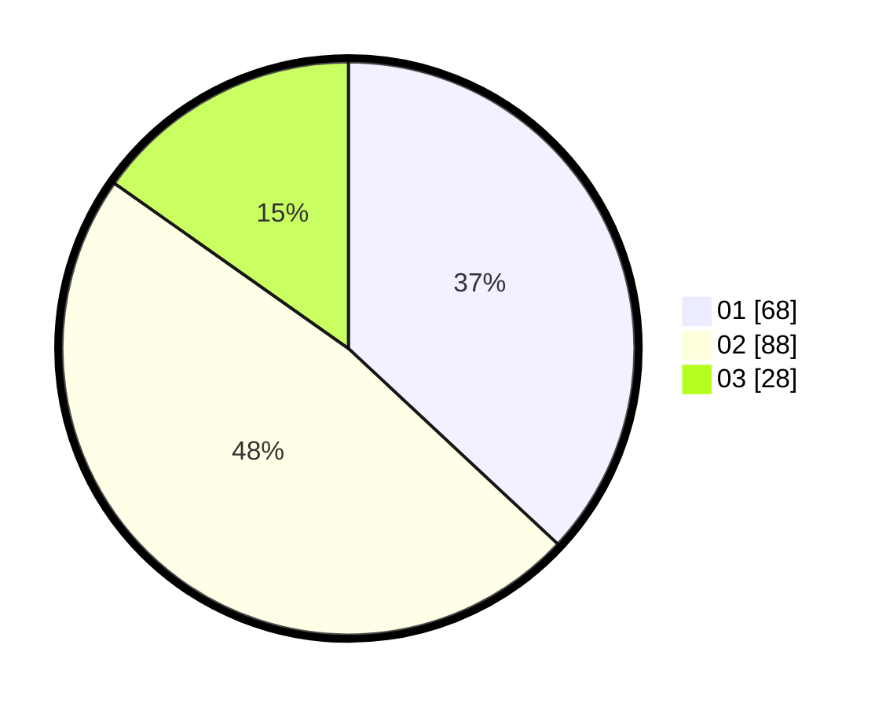

# Hasil

Hasil perolehan suara paslon dapat dilihat pada file paslon-01.txt, paslon-02.txt, dan paslon-03.txt.

Jika tidak ada, artinya data tersebut belum ada pada SIREKAP.

## Perolehan Suara

 * Paslon 01: **68**.
 * Paslon 02: **88**.
 * Paslon 03: **28**.

## Foto C Plano

https://sirekap-obj-formc.kpu.go.id/9954/pemilu/ppwp/31/71/03/10/04/3171031004095-20240214-193321--0aafce52-4285-435a-a609-de7e85bf8503.jpg

https://sirekap-obj-formc.kpu.go.id/9954/pemilu/ppwp/31/71/03/10/04/3171031004095-20240214-211801--f595cf48-4858-40d4-ac1f-62fd54befc8e.jpg

https://sirekap-obj-formc.kpu.go.id/9954/pemilu/ppwp/31/71/03/10/04/3171031004095-20240215-002232--b1758d96-0f57-42b4-91e0-3a2ffd62d104.jpg

## DATA PEMILIH TETAP

Jumlah pemilih dalam DPT: **281**.
 * L: **81**.
 * P: **200**.

## DATA PENGGUNA HAK PILIH

Jumlah pengguna hak pilih dalam DPT: **181**.
 * L: **81**.
 * P: **100**.

Jumlah pengguna hak pilih dalam DPTb: **6**.
 * L: **4**.
 * P: **2**.

Jumlah pengguna hak pilih dalam DPK: **0**.
 * L: **0**.
 * P: **0**.

Jumlah pengguna hak pilih: **187**.
 * L: **85**.
 * P: **102**.

## JUMLAH SUARA SAH DAN TIDAK SAH

JUMLAH SELURUH SUARA SAH: **184**.

JUMLAH SUARA TIDAK SAH: **3**.

JUMLAH SELURUH SUARA SAH DAN SUARA TIDAK SAH: **187**.
