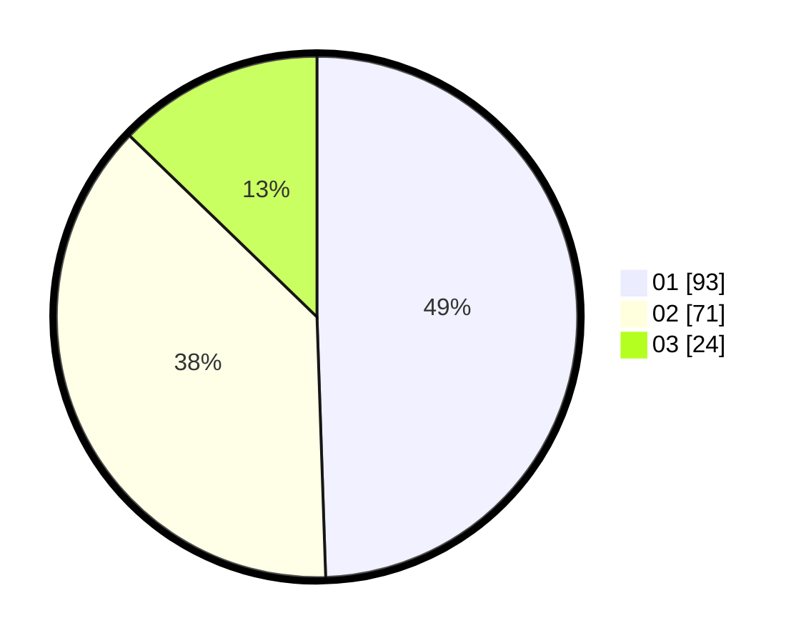

# Hasil

Hasil perolehan suara paslon dapat dilihat pada file paslon-01.txt, paslon-02.txt, dan paslon-03.txt.

Jika tidak ada, artinya data tersebut belum ada pada SIREKAP.

## Perolehan Suara

 * Paslon 01: **93**.
 * Paslon 02: **71**.
 * Paslon 03: **24**.

## Foto C Plano

https://sirekap-obj-formc.kpu.go.id/cb5b/pemilu/ppwp/31/71/03/10/04/3171031004096-20240214-201039--cbc71e59-cc89-41df-b5e4-c8333e7a188c.jpg

https://sirekap-obj-formc.kpu.go.id/cb5b/pemilu/ppwp/31/71/03/10/04/3171031004096-20240214-201053--335aa2cb-83b9-4860-b574-52d637cd0b7b.jpg

https://sirekap-obj-formc.kpu.go.id/cb5b/pemilu/ppwp/31/71/03/10/04/3171031004096-20240214-201106--25339809-a9ff-4371-9a8f-6eb925469ddd.jpg

## DATA PEMILIH TETAP

Jumlah pemilih dalam DPT: **260**.
 * L: **131**.
 * P: **129**.

## DATA PENGGUNA HAK PILIH

Jumlah pengguna hak pilih dalam DPT: **181**.
 * L: **93**.
 * P: **88**.

Jumlah pengguna hak pilih dalam DPTb: **4**.
 * L: **1**.
 * P: **3**.

Jumlah pengguna hak pilih dalam DPK: **3**.
 * L: **2**.
 * P: **1**.

Jumlah pengguna hak pilih: **188**.
 * L: **96**.
 * P: **92**.

## JUMLAH SUARA SAH DAN TIDAK SAH

JUMLAH SELURUH SUARA SAH: **188**.

JUMLAH SUARA TIDAK SAH: **0**.

JUMLAH SELURUH SUARA SAH DAN SUARA TIDAK SAH: **188**.
