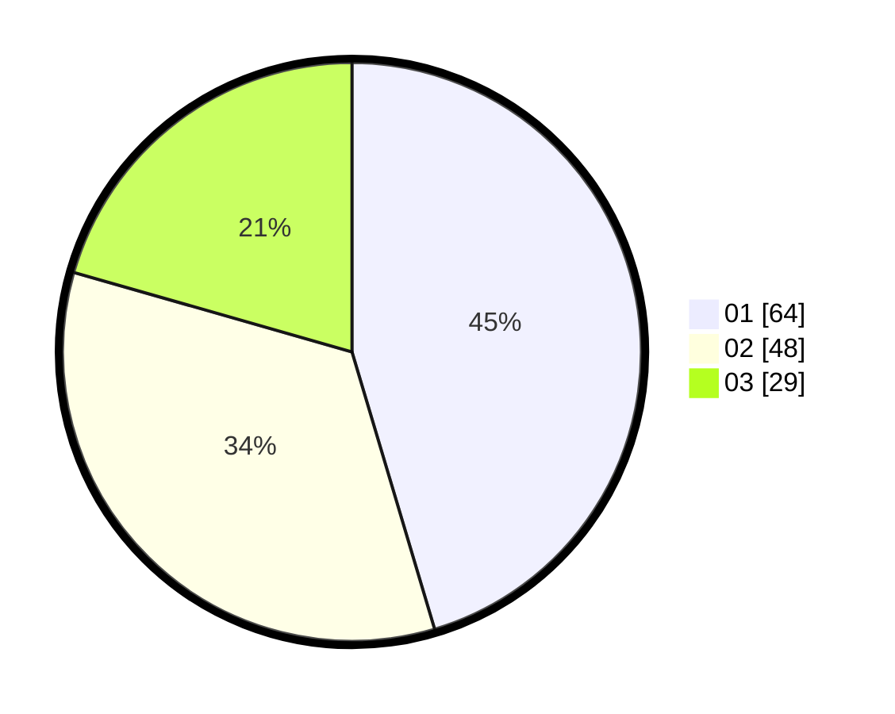

# Hasil

Hasil perolehan suara paslon dapat dilihat pada file paslon-01.txt, paslon-02.txt, dan paslon-03.txt.

Jika tidak ada, artinya data tersebut belum ada pada SIREKAP.

## Perolehan Suara

 * Paslon 01: **64**.
 * Paslon 02: **48**.
 * Paslon 03: **29**.

## Foto C Plano

https://sirekap-obj-formc.kpu.go.id/8e22/pemilu/ppwp/31/71/03/10/04/3171031004097-20240214-191618--d84de6eb-517c-4eee-a128-122b32155285.jpg

https://sirekap-obj-formc.kpu.go.id/8e22/pemilu/ppwp/31/71/03/10/04/3171031004097-20240214-191634--e3173365-c9af-4242-b95b-f2fe8950a765.jpg

https://sirekap-obj-formc.kpu.go.id/8e22/pemilu/ppwp/31/71/03/10/04/3171031004097-20240214-191637--272f5566-8f6d-47f3-8e3c-e554e12a28da.jpg

## DATA PEMILIH TETAP

Jumlah pemilih dalam DPT: **267**.
 * L: **143**.
 * P: **124**.

## DATA PENGGUNA HAK PILIH

Jumlah pengguna hak pilih dalam DPT: **146**.
 * L: **74**.
 * P: **72**.

Jumlah pengguna hak pilih dalam DPTb: **0**.
 * L: **0**.
 * P: **0**.

Jumlah pengguna hak pilih dalam DPK: **1**.
 * L: **1**.
 * P: **0**.

Jumlah pengguna hak pilih: **147**.
 * L: **75**.
 * P: **72**.

## JUMLAH SUARA SAH DAN TIDAK SAH

JUMLAH SELURUH SUARA SAH: **141**.

JUMLAH SUARA TIDAK SAH: **6**.

JUMLAH SELURUH SUARA SAH DAN SUARA TIDAK SAH: **147**.
