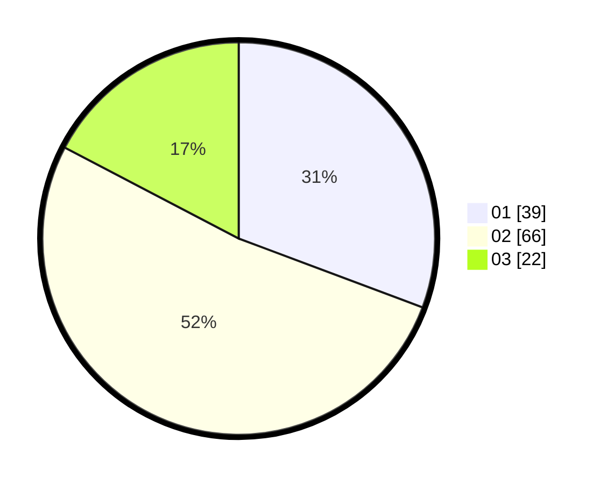

# Hasil

Hasil perolehan suara paslon dapat dilihat pada file paslon-01.txt, paslon-02.txt, dan paslon-03.txt.

Jika tidak ada, artinya data tersebut belum ada pada SIREKAP.

## Perolehan Suara

 * Paslon 01: **39**.
 * Paslon 02: **66**.
 * Paslon 03: **22**.

## Foto C Plano

https://sirekap-obj-formc.kpu.go.id/0f7c/pemilu/ppwp/31/71/03/10/04/3171031004098-20240214-224302--e98ce9ba-d12e-493b-8143-26d667c66677.jpg

https://sirekap-obj-formc.kpu.go.id/0f7c/pemilu/ppwp/31/71/03/10/04/3171031004098-20240214-224457--6532fa3d-422b-4f00-a5d9-46efb1af603e.jpg
