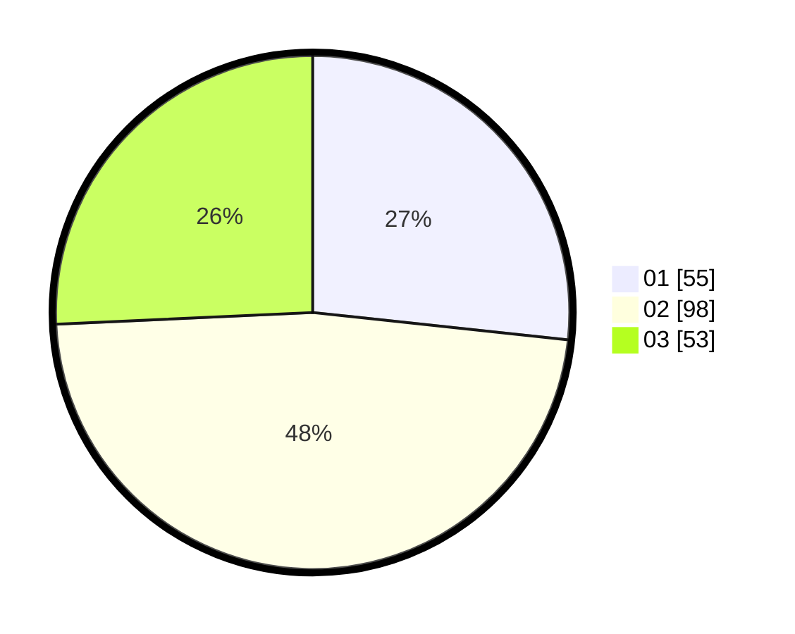

# Hasil

Hasil perolehan suara paslon dapat dilihat pada file paslon-01.txt, paslon-02.txt, dan paslon-03.txt.

Jika tidak ada, artinya data tersebut belum ada pada SIREKAP.

## Perolehan Suara

 * Paslon 01: **55**.
 * Paslon 02: **98**.
 * Paslon 03: **53**.

## Foto C Plano

https://sirekap-obj-formc.kpu.go.id/0506/pemilu/ppwp/31/71/03/10/05/3171031005004-20240216-074005--e789cbf4-46cc-44b2-861b-4bff3a22fd5b.jpg

https://sirekap-obj-formc.kpu.go.id/0506/pemilu/ppwp/31/71/03/10/05/3171031005004-20240216-082901--d099be7f-d3f8-4583-88e2-04ed98ff7ce5.jpg

https://sirekap-obj-formc.kpu.go.id/0506/pemilu/ppwp/31/71/03/10/05/3171031005004-20240216-074012--271417cc-e29d-4d9f-a813-da5bb62986f0.jpg

## DATA PEMILIH TETAP

Jumlah pemilih dalam DPT: **287**.
 * L: **140**.
 * P: **147**.

## DATA PENGGUNA HAK PILIH

Jumlah pengguna hak pilih dalam DPT: **199**.
 * L: **99**.
 * P: **100**.

Jumlah pengguna hak pilih dalam DPTb: **10**.
 * L: **4**.
 * P: **6**.

Jumlah pengguna hak pilih dalam DPK: **0**.
 * L: **0**.
 * P: **0**.

Jumlah pengguna hak pilih: **209**.
 * L: **103**.
 * P: **106**.

## JUMLAH SUARA SAH DAN TIDAK SAH

JUMLAH SELURUH SUARA SAH: **206**.

JUMLAH SUARA TIDAK SAH: **3**.

JUMLAH SELURUH SUARA SAH DAN SUARA TIDAK SAH: **209**.
