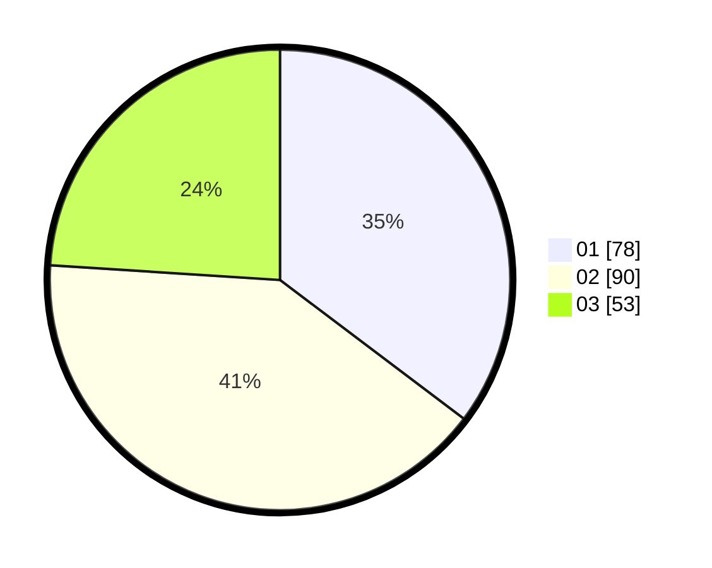

# Hasil

Hasil perolehan suara paslon dapat dilihat pada file paslon-01.txt, paslon-02.txt, dan paslon-03.txt.

Jika tidak ada, artinya data tersebut belum ada pada SIREKAP.

## Perolehan Suara

 * Paslon 01: **78**.
 * Paslon 02: **90**.
 * Paslon 03: **53**.

## Foto C Plano

https://sirekap-obj-formc.kpu.go.id/e6d2/pemilu/ppwp/31/71/03/10/05/3171031005005-20240216-084154--6967c3c0-f5ee-4f2e-8293-5814e8280636.jpg

https://sirekap-obj-formc.kpu.go.id/e6d2/pemilu/ppwp/31/71/03/10/05/3171031005005-20240215-213520--ca608920-7267-4476-b0a3-6141921e0466.jpg

https://sirekap-obj-formc.kpu.go.id/e6d2/pemilu/ppwp/31/71/03/10/05/3171031005005-20240215-213519--3f11cb7c-ac8b-4d3c-b2f4-00a8c46f879e.jpg

## DATA PEMILIH TETAP

Jumlah pemilih dalam DPT: **284**.
 * L: **138**.
 * P: **146**.

## DATA PENGGUNA HAK PILIH

Jumlah pengguna hak pilih dalam DPT: **217**.
 * L: **103**.
 * P: **114**.

Jumlah pengguna hak pilih dalam DPTb: **3**.
 * L: **1**.
 * P: **2**.

Jumlah pengguna hak pilih dalam DPK: **2**.
 * L: **1**.
 * P: **1**.

Jumlah pengguna hak pilih: **222**.
 * L: **105**.
 * P: **117**.

## JUMLAH SUARA SAH DAN TIDAK SAH

JUMLAH SELURUH SUARA SAH: **221**.

JUMLAH SUARA TIDAK SAH: **1**.

JUMLAH SELURUH SUARA SAH DAN SUARA TIDAK SAH: **222**.
