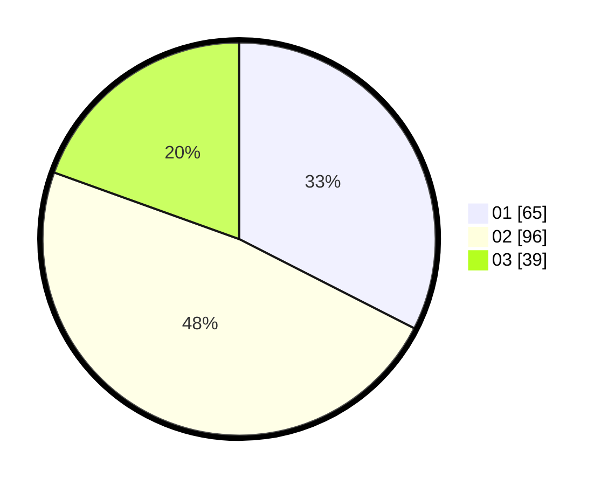

# Hasil

Hasil perolehan suara paslon dapat dilihat pada file paslon-01.txt, paslon-02.txt, dan paslon-03.txt.

Jika tidak ada, artinya data tersebut belum ada pada SIREKAP.

## Perolehan Suara

 * Paslon 01: **65**.
 * Paslon 02: **96**.
 * Paslon 03: **39**.

## Foto C Plano

https://sirekap-obj-formc.kpu.go.id/91b5/pemilu/ppwp/31/71/03/10/05/3171031005010-20240217-221315--8d83a008-196f-4f7e-a95b-05f6e51863bd.jpg

https://sirekap-obj-formc.kpu.go.id/91b5/pemilu/ppwp/31/71/03/10/05/3171031005010-20240217-221317--9994cf46-c2cb-46b1-b021-93928137d4fb.jpg

https://sirekap-obj-formc.kpu.go.id/91b5/pemilu/ppwp/31/71/03/10/05/3171031005010-20240217-221316--caa4f1b0-0ef8-453c-affe-0454a9781448.jpg

## DATA PEMILIH TETAP

Jumlah pemilih dalam DPT: **188**.
 * L: **105**.
 * P: **83**.

## DATA PENGGUNA HAK PILIH

Jumlah pengguna hak pilih dalam DPT: **201**.
 * L: **113**.
 * P: **88**.

Jumlah pengguna hak pilih dalam DPTb: **13**.
 * L: **8**.
 * P: **5**.

Jumlah pengguna hak pilih dalam DPK: **0**.
 * L: **0**.
 * P: **0**.

Jumlah pengguna hak pilih: **201**.
 * L: **113**.
 * P: **88**.

## JUMLAH SUARA SAH DAN TIDAK SAH

JUMLAH SELURUH SUARA SAH: **201**.

JUMLAH SUARA TIDAK SAH: **1**.

JUMLAH SELURUH SUARA SAH DAN SUARA TIDAK SAH: **202**.
