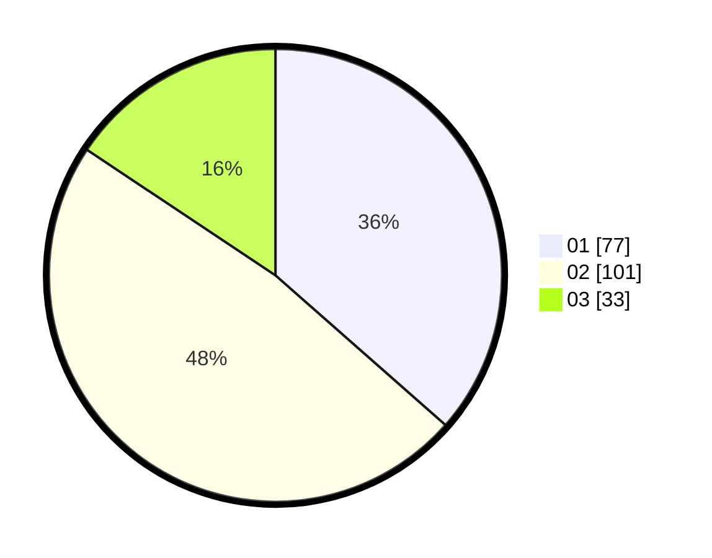

# Hasil

Hasil perolehan suara paslon dapat dilihat pada file paslon-01.txt, paslon-02.txt, dan paslon-03.txt.

Jika tidak ada, artinya data tersebut belum ada pada SIREKAP.

## Perolehan Suara

 * Paslon 01: **77**.
 * Paslon 02: **101**.
 * Paslon 03: **33**.

## Foto C Plano

https://sirekap-obj-formc.kpu.go.id/e102/pemilu/ppwp/31/71/03/10/05/3171031005011-20240216-134627--cd738900-552d-47a1-9716-6b79587015a6.jpg

https://sirekap-obj-formc.kpu.go.id/e102/pemilu/ppwp/31/71/03/10/05/3171031005011-20240216-134628--3af64050-5dbc-48c6-ac17-1f2f6e689745.jpg

https://sirekap-obj-formc.kpu.go.id/e102/pemilu/ppwp/31/71/03/10/05/3171031005011-20240216-134628--0c5a59fe-ac65-45a7-bf53-c090e4497321.jpg

## DATA PEMILIH TETAP

Jumlah pemilih dalam DPT: **272**.
 * L: **151**.
 * P: **121**.

## DATA PENGGUNA HAK PILIH

Jumlah pengguna hak pilih dalam DPT: **197**.
 * L: **107**.
 * P: **90**.

Jumlah pengguna hak pilih dalam DPTb: **17**.
 * L: **5**.
 * P: **12**.

Jumlah pengguna hak pilih dalam DPK: **3**.
 * L: **2**.
 * P: **1**.

Jumlah pengguna hak pilih: **217**.
 * L: **114**.
 * P: **103**.

## JUMLAH SUARA SAH DAN TIDAK SAH

JUMLAH SELURUH SUARA SAH: **211**.

JUMLAH SUARA TIDAK SAH: **6**.

JUMLAH SELURUH SUARA SAH DAN SUARA TIDAK SAH: **217**.
