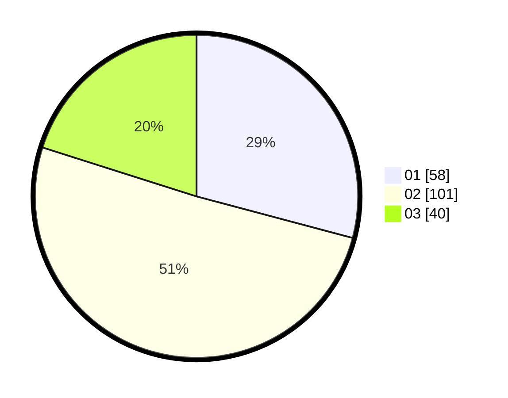

# Hasil

Hasil perolehan suara paslon dapat dilihat pada file paslon-01.txt, paslon-02.txt, dan paslon-03.txt.

Jika tidak ada, artinya data tersebut belum ada pada SIREKAP.

## Perolehan Suara

 * Paslon 01: **58**.
 * Paslon 02: **101**.
 * Paslon 03: **40**.

## Foto C Plano

https://sirekap-obj-formc.kpu.go.id/0941/pemilu/ppwp/31/71/03/10/05/3171031005020-20240214-190458--11fc9c3c-c6ad-4419-97ed-94dd6cbee261.jpg

https://sirekap-obj-formc.kpu.go.id/0941/pemilu/ppwp/31/71/03/10/05/3171031005020-20240214-190525--980ff65c-3e14-42a3-81da-5d4567ff4a6a.jpg

https://sirekap-obj-formc.kpu.go.id/0941/pemilu/ppwp/31/71/03/10/05/3171031005020-20240216-141124--6d4a9726-cd7f-4b66-8220-62f832ce823e.jpg

## DATA PEMILIH TETAP

Jumlah pemilih dalam DPT: **294**.
 * L: **146**.
 * P: **148**.

## DATA PENGGUNA HAK PILIH

Jumlah pengguna hak pilih dalam DPT: **186**.
 * L: **92**.
 * P: **94**.

Jumlah pengguna hak pilih dalam DPTb: **14**.
 * L: **6**.
 * P: **8**.

Jumlah pengguna hak pilih dalam DPK: **0**.
 * L: **0**.
 * P: **0**.

Jumlah pengguna hak pilih: **200**.
 * L: **98**.
 * P: **102**.

## JUMLAH SUARA SAH DAN TIDAK SAH

JUMLAH SELURUH SUARA SAH: **199**.

JUMLAH SUARA TIDAK SAH: **1**.

JUMLAH SELURUH SUARA SAH DAN SUARA TIDAK SAH: **200**.
