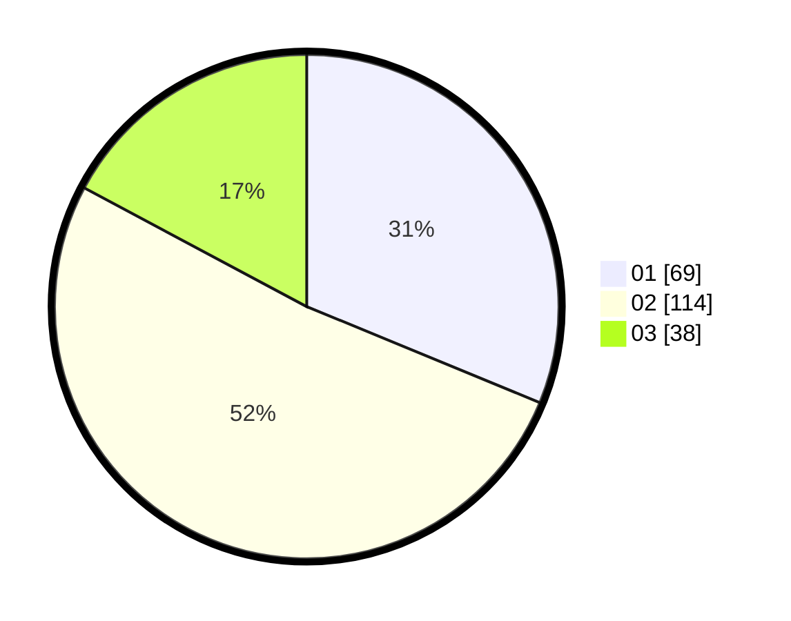

# Hasil

Hasil perolehan suara paslon dapat dilihat pada file paslon-01.txt, paslon-02.txt, dan paslon-03.txt.

Jika tidak ada, artinya data tersebut belum ada pada SIREKAP.

## Perolehan Suara

 * Paslon 01: **69**.
 * Paslon 02: **114**.
 * Paslon 03: **38**.

## Foto C Plano

https://sirekap-obj-formc.kpu.go.id/49a0/pemilu/ppwp/31/71/03/10/05/3171031005021-20240217-221016--a1ce649b-af92-45eb-abf8-76cc85b09302.jpg

https://sirekap-obj-formc.kpu.go.id/49a0/pemilu/ppwp/31/71/03/10/05/3171031005021-20240217-221017--5043d695-a5b1-4527-a43d-59ed20361a75.jpg

https://sirekap-obj-formc.kpu.go.id/49a0/pemilu/ppwp/31/71/03/10/05/3171031005021-20240217-221016--8731b2d6-a6e6-4f3f-9d41-8125254a815d.jpg

## DATA PEMILIH TETAP

Jumlah pemilih dalam DPT: **230**.
 * L: **114**.
 * P: **116**.

## DATA PENGGUNA HAK PILIH

Jumlah pengguna hak pilih dalam DPT: **224**.
 * L: **113**.
 * P: **111**.

Jumlah pengguna hak pilih dalam DPTb: **6**.
 * L: **1**.
 * P: **5**.

Jumlah pengguna hak pilih dalam DPK: **0**.
 * L: **0**.
 * P: **0**.

Jumlah pengguna hak pilih: **230**.
 * L: **114**.
 * P: **116**.

## JUMLAH SUARA SAH DAN TIDAK SAH

JUMLAH SELURUH SUARA SAH: **221**.

JUMLAH SUARA TIDAK SAH: **9**.

JUMLAH SELURUH SUARA SAH DAN SUARA TIDAK SAH: **230**.
