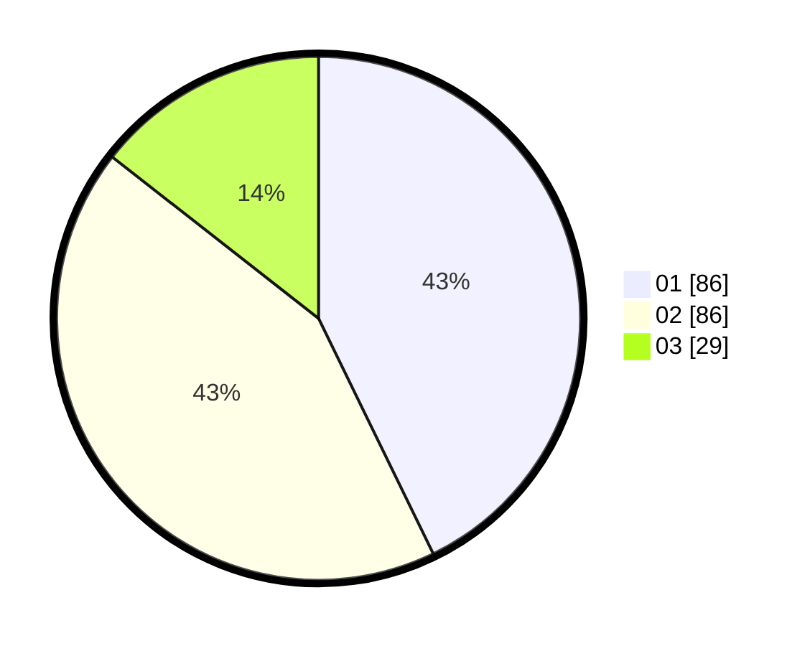

# Hasil

Hasil perolehan suara paslon dapat dilihat pada file paslon-01.txt, paslon-02.txt, dan paslon-03.txt.

Jika tidak ada, artinya data tersebut belum ada pada SIREKAP.

## Perolehan Suara

 * Paslon 01: **86**.
 * Paslon 02: **86**.
 * Paslon 03: **29**.

## Foto C Plano

https://sirekap-obj-formc.kpu.go.id/26cd/pemilu/ppwp/31/71/03/10/05/3171031005024-20240214-195611--d879b89a-611f-49fd-b888-b7221a34c0d9.jpg

https://sirekap-obj-formc.kpu.go.id/26cd/pemilu/ppwp/31/71/03/10/05/3171031005024-20240214-195721--d5985c2a-78d7-4155-8f3d-3566d13ddde4.jpg

https://sirekap-obj-formc.kpu.go.id/26cd/pemilu/ppwp/31/71/03/10/05/3171031005024-20240214-195851--28121671-d385-4940-8ff6-cf6f4c31ffed.jpg

## DATA PEMILIH TETAP

Jumlah pemilih dalam DPT: **268**.
 * L: **135**.
 * P: **133**.

## DATA PENGGUNA HAK PILIH

Jumlah pengguna hak pilih dalam DPT: **199**.
 * L: **96**.
 * P: **103**.

Jumlah pengguna hak pilih dalam DPTb: **8**.
 * L: **2**.
 * P: **6**.

Jumlah pengguna hak pilih dalam DPK: **3**.
 * L: **2**.
 * P: **1**.

Jumlah pengguna hak pilih: **210**.
 * L: **100**.
 * P: **110**.

## JUMLAH SUARA SAH DAN TIDAK SAH

JUMLAH SELURUH SUARA SAH: **201**.

JUMLAH SUARA TIDAK SAH: **9**.

JUMLAH SELURUH SUARA SAH DAN SUARA TIDAK SAH: **210**.
