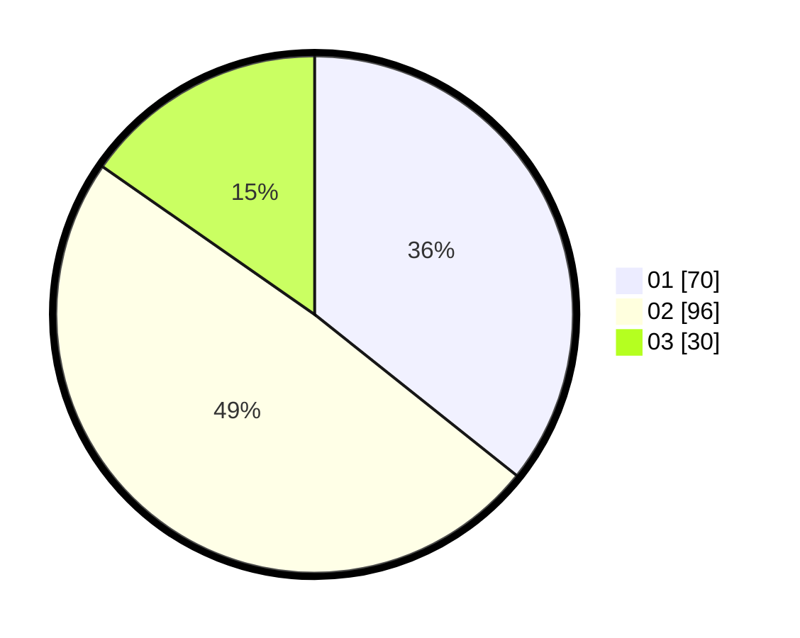

# Hasil

Hasil perolehan suara paslon dapat dilihat pada file paslon-01.txt, paslon-02.txt, dan paslon-03.txt.

Jika tidak ada, artinya data tersebut belum ada pada SIREKAP.

## Perolehan Suara

 * Paslon 01: **70**.
 * Paslon 02: **96**.
 * Paslon 03: **30**.

## Foto C Plano

https://sirekap-obj-formc.kpu.go.id/782f/pemilu/ppwp/31/71/03/10/05/3171031005029-20240215-213343--7ba93979-0885-4e51-929c-c8c3ab5ab42d.jpg

https://sirekap-obj-formc.kpu.go.id/782f/pemilu/ppwp/31/71/03/10/05/3171031005029-20240215-213346--981a88b1-f298-48a6-9496-c4545ba4392f.jpg

https://sirekap-obj-formc.kpu.go.id/782f/pemilu/ppwp/31/71/03/10/05/3171031005029-20240215-213344--45ff44ff-4f65-4ab5-9a90-0de347f40c3d.jpg

## DATA PEMILIH TETAP

Jumlah pemilih dalam DPT: **248**.
 * L: **123**.
 * P: **125**.

## DATA PENGGUNA HAK PILIH

Jumlah pengguna hak pilih dalam DPT: **193**.
 * L: **91**.
 * P: **102**.

Jumlah pengguna hak pilih dalam DPTb: **8**.
 * L: **6**.
 * P: **2**.

Jumlah pengguna hak pilih dalam DPK: **2**.
 * L: **2**.
 * P: **0**.

Jumlah pengguna hak pilih: **203**.
 * L: **99**.
 * P: **104**.

## JUMLAH SUARA SAH DAN TIDAK SAH

JUMLAH SELURUH SUARA SAH: **196**.

JUMLAH SUARA TIDAK SAH: **7**.

JUMLAH SELURUH SUARA SAH DAN SUARA TIDAK SAH: **203**.
