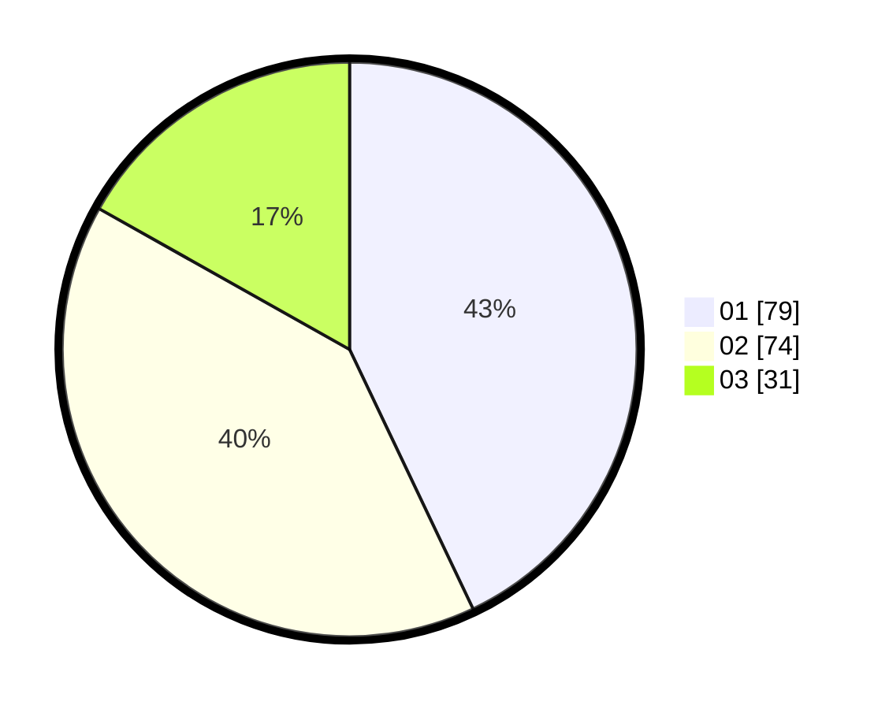

# Hasil

Hasil perolehan suara paslon dapat dilihat pada file paslon-01.txt, paslon-02.txt, dan paslon-03.txt.

Jika tidak ada, artinya data tersebut belum ada pada SIREKAP.

## Perolehan Suara

 * Paslon 01: **79**.
 * Paslon 02: **74**.
 * Paslon 03: **31**.

## Foto C Plano

https://sirekap-obj-formc.kpu.go.id/ef45/pemilu/ppwp/31/71/03/10/05/3171031005036-20240214-155527--9045bc9b-2dfa-4cb5-8283-660a419fdef9.jpg

https://sirekap-obj-formc.kpu.go.id/ef45/pemilu/ppwp/31/71/03/10/05/3171031005036-20240214-160101--af898e76-a2ef-4878-a361-e9ff56f1c830.jpg
