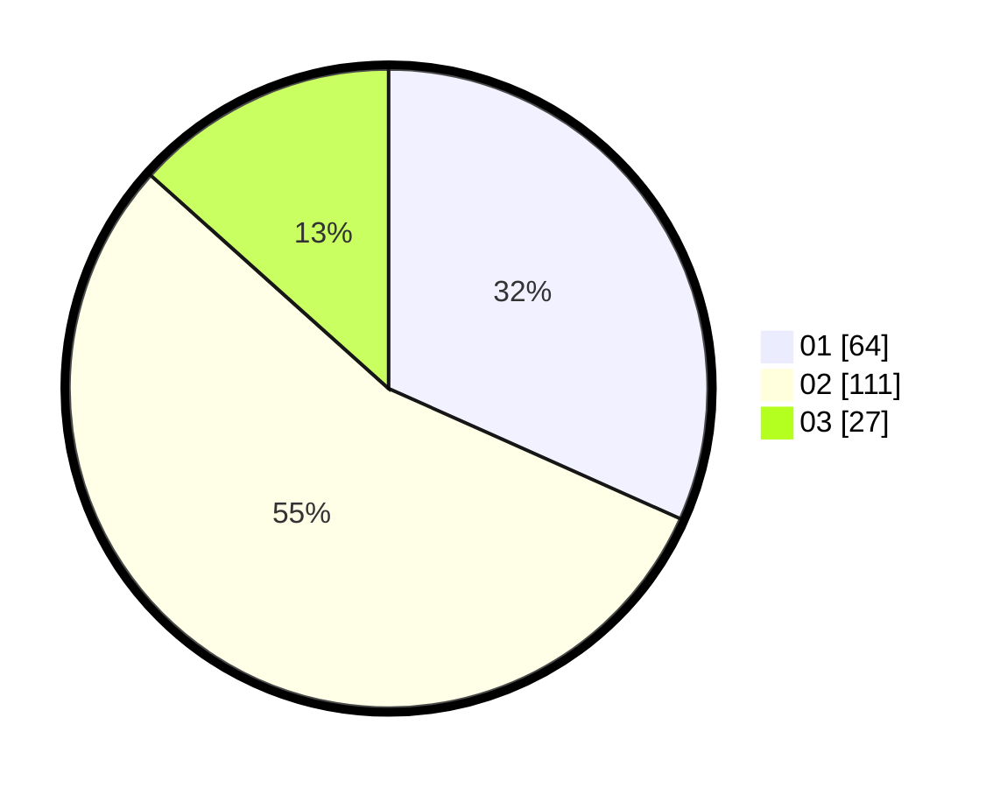

# Hasil

Hasil perolehan suara paslon dapat dilihat pada file paslon-01.txt, paslon-02.txt, dan paslon-03.txt.

Jika tidak ada, artinya data tersebut belum ada pada SIREKAP.

## Perolehan Suara

 * Paslon 01: **64**.
 * Paslon 02: **111**.
 * Paslon 03: **27**.

## Foto C Plano

https://sirekap-obj-formc.kpu.go.id/c34d/pemilu/ppwp/31/71/03/10/05/3171031005039-20240217-202831--89563097-82cf-45cd-b1a5-99ec624238f3.jpg

https://sirekap-obj-formc.kpu.go.id/c34d/pemilu/ppwp/31/71/03/10/05/3171031005039-20240217-202832--12bee463-f3cd-43d5-a73a-60546cbaaf2d.jpg

https://sirekap-obj-formc.kpu.go.id/c34d/pemilu/ppwp/31/71/03/10/05/3171031005039-20240217-202832--166a2b63-2ca3-461d-87f7-e85cb2bbdf08.jpg

## DATA PEMILIH TETAP

Jumlah pemilih dalam DPT: **263**.
 * L: **136**.
 * P: **127**.

## DATA PENGGUNA HAK PILIH

Jumlah pengguna hak pilih dalam DPT: **189**.
 * L: **94**.
 * P: **95**.

Jumlah pengguna hak pilih dalam DPTb: **10**.
 * L: **2**.
 * P: **8**.

Jumlah pengguna hak pilih dalam DPK: **3**.
 * L: **1**.
 * P: **2**.

Jumlah pengguna hak pilih: **202**.
 * L: **97**.
 * P: **105**.

## JUMLAH SUARA SAH DAN TIDAK SAH

JUMLAH SELURUH SUARA SAH: **202**.

JUMLAH SUARA TIDAK SAH: **2**.

JUMLAH SELURUH SUARA SAH DAN SUARA TIDAK SAH: **204**.
