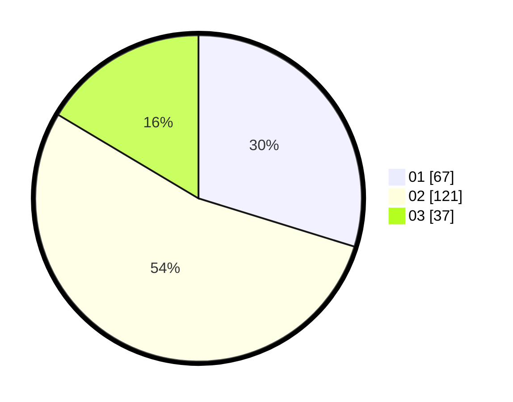

# Hasil

Hasil perolehan suara paslon dapat dilihat pada file paslon-01.txt, paslon-02.txt, dan paslon-03.txt.

Jika tidak ada, artinya data tersebut belum ada pada SIREKAP.

## Perolehan Suara

 * Paslon 01: **67**.
 * Paslon 02: **121**.
 * Paslon 03: **37**.

## Foto C Plano

https://sirekap-obj-formc.kpu.go.id/12f7/pemilu/ppwp/31/71/03/10/05/3171031005043-20240214-185831--d0e4b00b-80d2-4efe-b8fc-794f4e8eed04.jpg

https://sirekap-obj-formc.kpu.go.id/12f7/pemilu/ppwp/31/71/03/10/05/3171031005043-20240214-190239--3172c131-01d2-4331-ba67-1dfd056fced7.jpg

https://sirekap-obj-formc.kpu.go.id/12f7/pemilu/ppwp/31/71/03/10/05/3171031005043-20240214-185954--d9e9fd40-1382-4f24-b3ea-32d2e786922f.jpg
