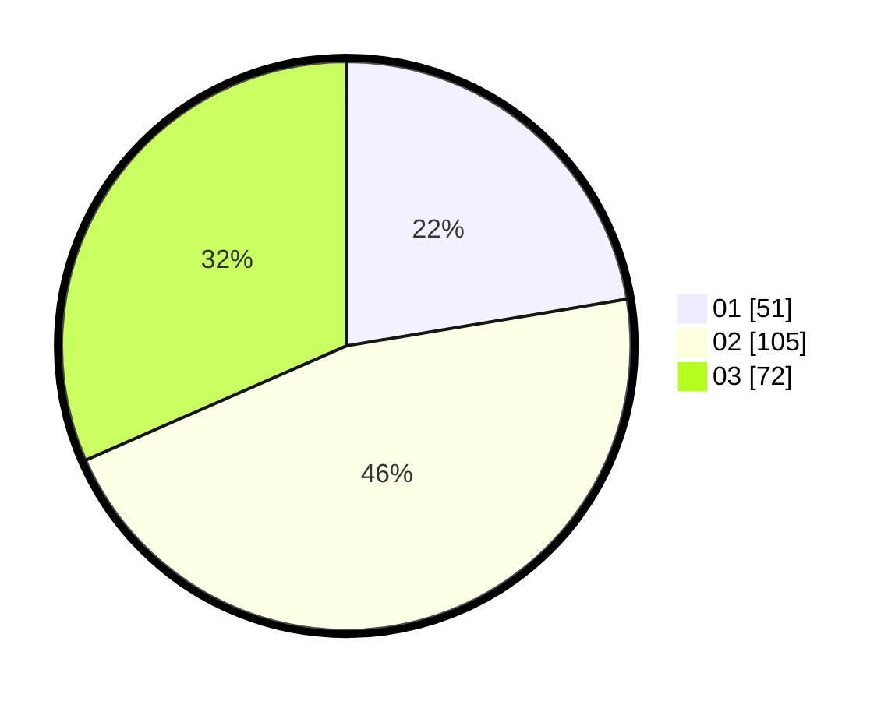

# Hasil

Hasil perolehan suara paslon dapat dilihat pada file paslon-01.txt, paslon-02.txt, dan paslon-03.txt.

Jika tidak ada, artinya data tersebut belum ada pada SIREKAP.

## Perolehan Suara

 * Paslon 01: **51**.
 * Paslon 02: **105**.
 * Paslon 03: **72**.

## Foto C Plano

https://sirekap-obj-formc.kpu.go.id/5b47/pemilu/ppwp/31/71/03/10/05/3171031005045-20240216-121459--3b2e15bd-1917-49d9-878a-72bac0efd810.jpg

https://sirekap-obj-formc.kpu.go.id/5b47/pemilu/ppwp/31/71/03/10/05/3171031005045-20240216-121502--a56f16a4-4377-4f57-8128-77a320b99390.jpg

https://sirekap-obj-formc.kpu.go.id/5b47/pemilu/ppwp/31/71/03/10/05/3171031005045-20240216-121500--6477b9a0-74cc-4eef-9fd8-bb6b69dfd5d9.jpg

## DATA PEMILIH TETAP

Jumlah pemilih dalam DPT: **289**.
 * L: **147**.
 * P: **142**.

## DATA PENGGUNA HAK PILIH

Jumlah pengguna hak pilih dalam DPT: **219**.
 * L: **105**.
 * P: **114**.

Jumlah pengguna hak pilih dalam DPTb: **12**.
 * L: **7**.
 * P: **5**.

Jumlah pengguna hak pilih dalam DPK: **1**.
 * L: **1**.
 * P: **0**.

Jumlah pengguna hak pilih: **232**.
 * L: **113**.
 * P: **119**.

## JUMLAH SUARA SAH DAN TIDAK SAH

JUMLAH SELURUH SUARA SAH: **228**.

JUMLAH SUARA TIDAK SAH: **4**.

JUMLAH SELURUH SUARA SAH DAN SUARA TIDAK SAH: **232**.
