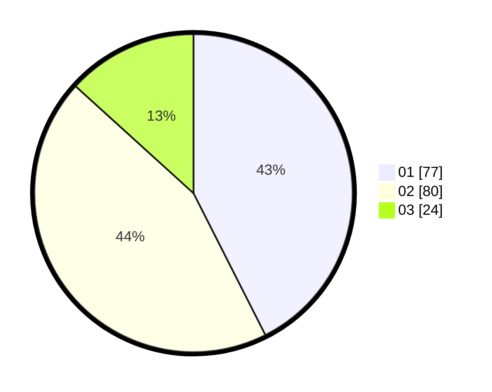

# Hasil

Hasil perolehan suara paslon dapat dilihat pada file paslon-01.txt, paslon-02.txt, dan paslon-03.txt.

Jika tidak ada, artinya data tersebut belum ada pada SIREKAP.

## Perolehan Suara

 * Paslon 01: **77**.
 * Paslon 02: **80**.
 * Paslon 03: **24**.

## Foto C Plano

https://sirekap-obj-formc.kpu.go.id/dca0/pemilu/ppwp/31/71/03/10/05/3171031005048-20240216-151309--66106ae7-cccf-4b5f-90f8-39e66364f8d5.jpg

https://sirekap-obj-formc.kpu.go.id/dca0/pemilu/ppwp/31/71/03/10/05/3171031005048-20240216-151311--7d3399ac-0107-411e-b6c6-56957e6133ea.jpg

https://sirekap-obj-formc.kpu.go.id/dca0/pemilu/ppwp/31/71/03/10/05/3171031005048-20240216-151310--4f2d66f5-0938-4695-9289-f9ec73a288a2.jpg

## DATA PEMILIH TETAP

Jumlah pemilih dalam DPT: **284**.
 * L: **152**.
 * P: **132**.

## DATA PENGGUNA HAK PILIH

Jumlah pengguna hak pilih dalam DPT: **180**.
 * L: **83**.
 * P: **97**.

Jumlah pengguna hak pilih dalam DPTb: **1**.
 * L: **0**.
 * P: **1**.

Jumlah pengguna hak pilih dalam DPK: **0**.
 * L: **0**.
 * P: **0**.

Jumlah pengguna hak pilih: **181**.
 * L: **83**.
 * P: **98**.

## JUMLAH SUARA SAH DAN TIDAK SAH

JUMLAH SELURUH SUARA SAH: **181**.

JUMLAH SUARA TIDAK SAH: **0**.

JUMLAH SELURUH SUARA SAH DAN SUARA TIDAK SAH: **181**.
