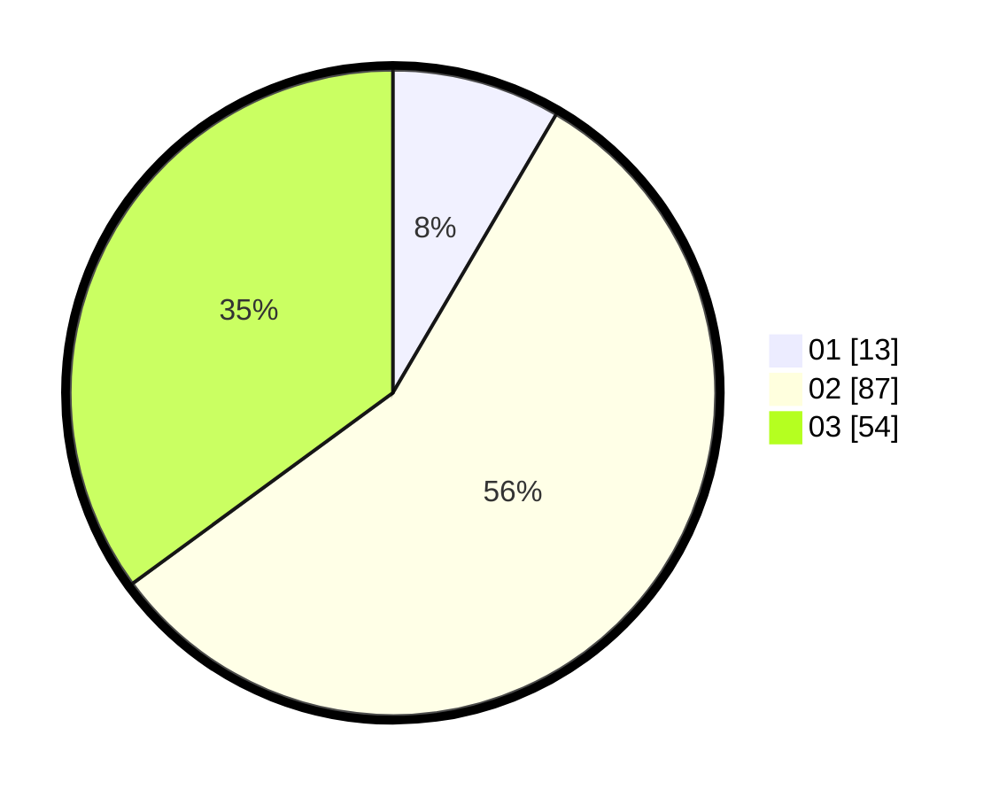

# Hasil

Hasil perolehan suara paslon dapat dilihat pada file paslon-01.txt, paslon-02.txt, dan paslon-03.txt.

Jika tidak ada, artinya data tersebut belum ada pada SIREKAP.

## Perolehan Suara

 * Paslon 01: **13**.
 * Paslon 02: **87**.
 * Paslon 03: **54**.

## Foto C Plano

https://sirekap-obj-formc.kpu.go.id/d969/pemilu/ppwp/31/71/03/10/05/3171031005049-20240215-015601--55e9f14a-930c-4770-9a0c-c8e9346b21c6.jpg

https://sirekap-obj-formc.kpu.go.id/d969/pemilu/ppwp/31/71/03/10/05/3171031005049-20240215-015624--2ff6cbcb-cdc7-4b61-aaec-d60e58b4c722.jpg

https://sirekap-obj-formc.kpu.go.id/d969/pemilu/ppwp/31/71/03/10/05/3171031005049-20240215-015612--33f2c2d1-c13d-404e-a7bd-799795be4a4a.jpg

## DATA PEMILIH TETAP

Jumlah pemilih dalam DPT: **219**.
 * L: **108**.
 * P: **111**.

## DATA PENGGUNA HAK PILIH

Jumlah pengguna hak pilih dalam DPT: **141**.
 * L: **77**.
 * P: **64**.

Jumlah pengguna hak pilih dalam DPTb: **11**.
 * L: **7**.
 * P: **4**.

Jumlah pengguna hak pilih dalam DPK: **3**.
 * L: **1**.
 * P: **2**.

Jumlah pengguna hak pilih: **155**.
 * L: **85**.
 * P: **70**.

## JUMLAH SUARA SAH DAN TIDAK SAH

JUMLAH SELURUH SUARA SAH: **154**.

JUMLAH SUARA TIDAK SAH: **1**.

JUMLAH SELURUH SUARA SAH DAN SUARA TIDAK SAH: **155**.
