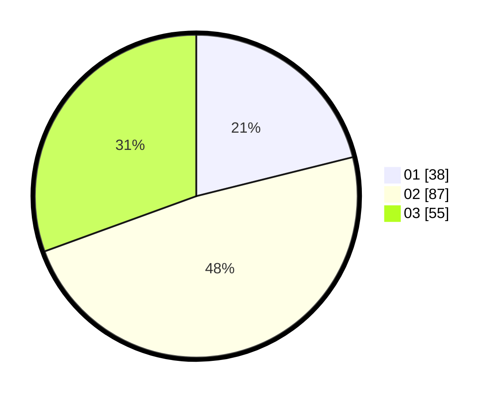

# Hasil

Hasil perolehan suara paslon dapat dilihat pada file paslon-01.txt, paslon-02.txt, dan paslon-03.txt.

Jika tidak ada, artinya data tersebut belum ada pada SIREKAP.

## Perolehan Suara

 * Paslon 01: **38**.
 * Paslon 02: **87**.
 * Paslon 03: **55**.

## Foto C Plano

https://sirekap-obj-formc.kpu.go.id/eacd/pemilu/ppwp/31/71/03/10/05/3171031005054-20240216-113245--5e106a21-e22a-48a5-8f8d-12e00d1f73cd.jpg

https://sirekap-obj-formc.kpu.go.id/eacd/pemilu/ppwp/31/71/03/10/05/3171031005054-20240216-141748--b54953df-19f2-4e73-b5a3-73cad504c248.jpg

https://sirekap-obj-formc.kpu.go.id/eacd/pemilu/ppwp/31/71/03/10/05/3171031005054-20240216-125001--8d936c23-2056-49dc-a489-b4630e119689.jpg
