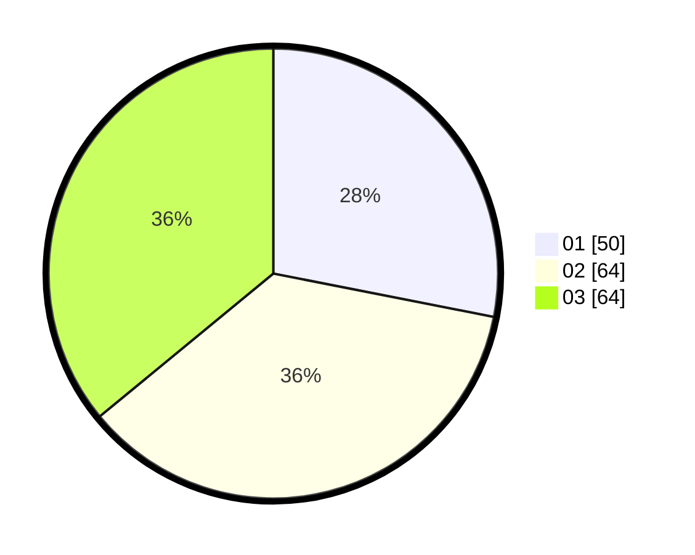

# Hasil

Hasil perolehan suara paslon dapat dilihat pada file paslon-01.txt, paslon-02.txt, dan paslon-03.txt.

Jika tidak ada, artinya data tersebut belum ada pada SIREKAP.

## Perolehan Suara

 * Paslon 01: **50**.
 * Paslon 02: **64**.
 * Paslon 03: **64**.

## Foto C Plano

https://sirekap-obj-formc.kpu.go.id/6b9f/pemilu/ppwp/31/71/03/10/05/3171031005056-20240215-230811--8615801e-d98f-48d6-8f05-1b755bbcbf6d.jpg

https://sirekap-obj-formc.kpu.go.id/6b9f/pemilu/ppwp/31/71/03/10/05/3171031005056-20240215-230813--a5b3f63a-48a5-40ac-8e3d-ee6f637a962e.jpg

https://sirekap-obj-formc.kpu.go.id/6b9f/pemilu/ppwp/31/71/03/10/05/3171031005056-20240215-230812--bd8e94b5-a60d-4045-b374-3123c64871de.jpg

## DATA PEMILIH TETAP

Jumlah pemilih dalam DPT: **244**.
 * L: **123**.
 * P: **121**.

## DATA PENGGUNA HAK PILIH

Jumlah pengguna hak pilih dalam DPT: **175**.
 * L: **88**.
 * P: **87**.

Jumlah pengguna hak pilih dalam DPTb: **5**.
 * L: **4**.
 * P: **1**.

Jumlah pengguna hak pilih dalam DPK: **0**.
 * L: **0**.
 * P: **0**.

Jumlah pengguna hak pilih: **180**.
 * L: **92**.
 * P: **88**.

## JUMLAH SUARA SAH DAN TIDAK SAH

JUMLAH SELURUH SUARA SAH: **178**.

JUMLAH SUARA TIDAK SAH: **2**.

JUMLAH SELURUH SUARA SAH DAN SUARA TIDAK SAH: **180**.
