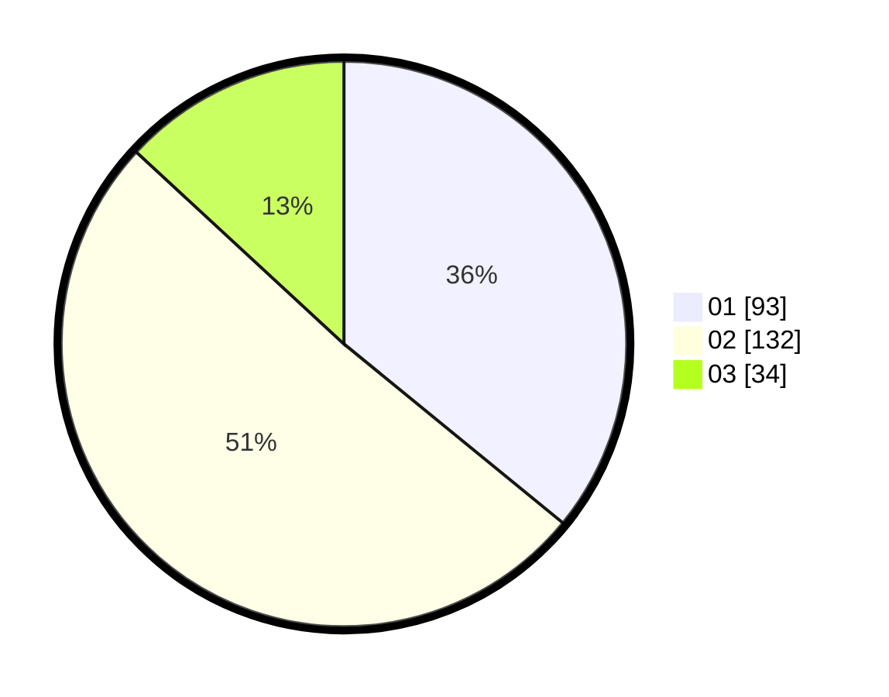

# Hasil

Hasil perolehan suara paslon dapat dilihat pada file paslon-01.txt, paslon-02.txt, dan paslon-03.txt.

Jika tidak ada, artinya data tersebut belum ada pada SIREKAP.

## Perolehan Suara

 * Paslon 01: **93**.
 * Paslon 02: **132**.
 * Paslon 03: **34**.

## Foto C Plano

https://sirekap-obj-formc.kpu.go.id/0dee/pemilu/ppwp/31/71/03/10/05/3171031005060-20240214-155117--0b7c02c1-b5c5-4dd0-b002-7e8244013bc8.jpg

https://sirekap-obj-formc.kpu.go.id/0dee/pemilu/ppwp/31/71/03/10/05/3171031005060-20240214-160115--fc0282fc-0e5d-44e5-babc-ced81bd2bbd8.jpg
