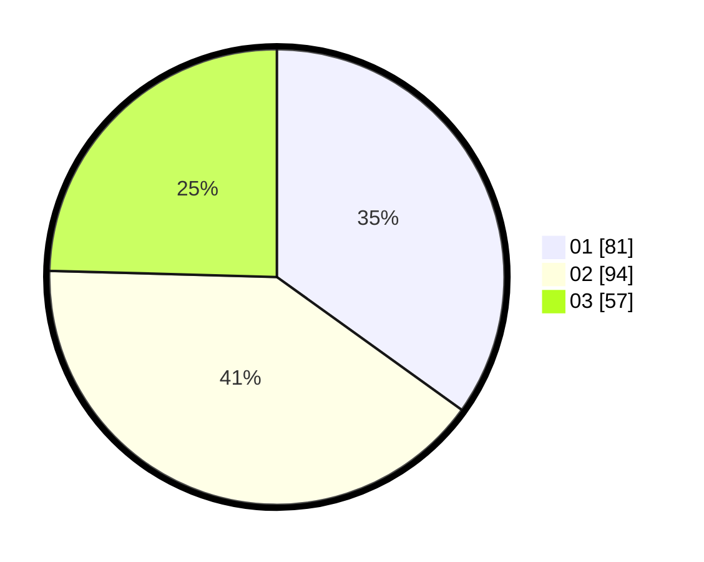

# Hasil

Hasil perolehan suara paslon dapat dilihat pada file paslon-01.txt, paslon-02.txt, dan paslon-03.txt.

Jika tidak ada, artinya data tersebut belum ada pada SIREKAP.

## Perolehan Suara

 * Paslon 01: **81**.
 * Paslon 02: **94**.
 * Paslon 03: **57**.

## Foto C Plano

https://sirekap-obj-formc.kpu.go.id/75f8/pemilu/ppwp/31/71/03/10/05/3171031005061-20240216-155047--8bd40d3b-1b9a-4949-9e96-86d5a4c3d35b.jpg

https://sirekap-obj-formc.kpu.go.id/75f8/pemilu/ppwp/31/71/03/10/05/3171031005061-20240214-201233--72498e8f-5d9a-4dd2-9a79-d1bf5f4b1e0e.jpg

https://sirekap-obj-formc.kpu.go.id/75f8/pemilu/ppwp/31/71/03/10/05/3171031005061-20240214-201342--8c9d8538-de1b-413d-bcbf-de85701fc29b.jpg

## DATA PEMILIH TETAP

Jumlah pemilih dalam DPT: **285**.
 * L: **146**.
 * P: **139**.

## DATA PENGGUNA HAK PILIH

Jumlah pengguna hak pilih dalam DPT: **229**.
 * L: **115**.
 * P: **114**.

Jumlah pengguna hak pilih dalam DPTb: **6**.
 * L: **3**.
 * P: **3**.

Jumlah pengguna hak pilih dalam DPK: **0**.
 * L: **0**.
 * P: **0**.

Jumlah pengguna hak pilih: **235**.
 * L: **118**.
 * P: **117**.

## JUMLAH SUARA SAH DAN TIDAK SAH

JUMLAH SELURUH SUARA SAH: **232**.

JUMLAH SUARA TIDAK SAH: **3**.

JUMLAH SELURUH SUARA SAH DAN SUARA TIDAK SAH: **235**.
