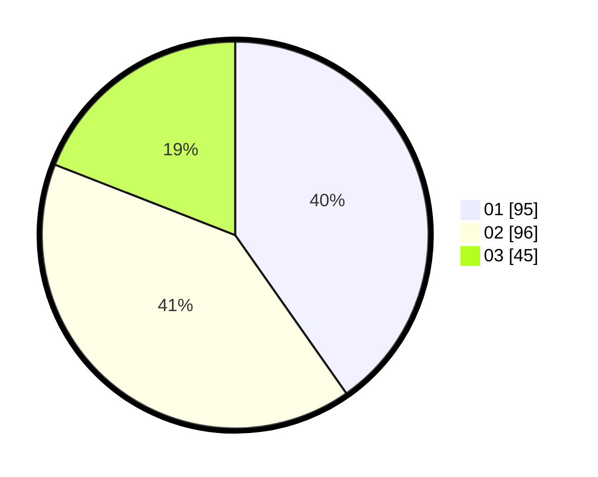

# Hasil

Hasil perolehan suara paslon dapat dilihat pada file paslon-01.txt, paslon-02.txt, dan paslon-03.txt.

Jika tidak ada, artinya data tersebut belum ada pada SIREKAP.

## Perolehan Suara

 * Paslon 01: **95**.
 * Paslon 02: **96**.
 * Paslon 03: **45**.

## Foto C Plano

https://sirekap-obj-formc.kpu.go.id/111b/pemilu/ppwp/31/71/03/10/05/3171031005062-20240214-184845--aee7a670-93c4-4745-90b8-e1f7824acbfa.jpg

https://sirekap-obj-formc.kpu.go.id/111b/pemilu/ppwp/31/71/03/10/05/3171031005062-20240214-185536--5ec662a0-168c-4372-b418-dadb83ecf673.jpg

https://sirekap-obj-formc.kpu.go.id/111b/pemilu/ppwp/31/71/03/10/05/3171031005062-20240214-190504--adebaacf-fe30-4b31-9195-de2520f59265.jpg

## DATA PEMILIH TETAP

Jumlah pemilih dalam DPT: **269**.
 * L: **129**.
 * P: **140**.

## DATA PENGGUNA HAK PILIH

Jumlah pengguna hak pilih dalam DPT: **232**.
 * L: **108**.
 * P: **124**.

Jumlah pengguna hak pilih dalam DPTb: **4**.
 * L: **3**.
 * P: **1**.

Jumlah pengguna hak pilih dalam DPK: **0**.
 * L: **0**.
 * P: **0**.

Jumlah pengguna hak pilih: **236**.
 * L: **111**.
 * P: **125**.

## JUMLAH SUARA SAH DAN TIDAK SAH

JUMLAH SELURUH SUARA SAH: **236**.

JUMLAH SUARA TIDAK SAH: **0**.

JUMLAH SELURUH SUARA SAH DAN SUARA TIDAK SAH: **236**.
