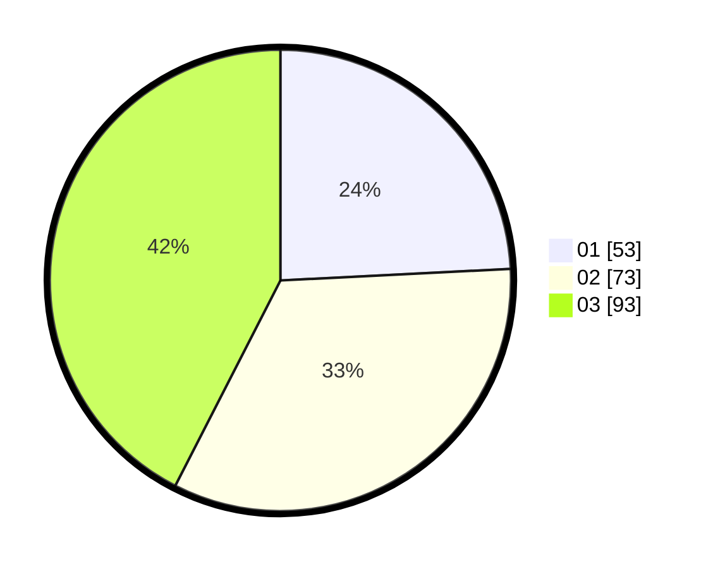

# Hasil

Hasil perolehan suara paslon dapat dilihat pada file paslon-01.txt, paslon-02.txt, dan paslon-03.txt.

Jika tidak ada, artinya data tersebut belum ada pada SIREKAP.

## Perolehan Suara

 * Paslon 01: **53**.
 * Paslon 02: **73**.
 * Paslon 03: **93**.

## Foto C Plano

https://sirekap-obj-formc.kpu.go.id/07f7/pemilu/ppwp/31/71/03/10/05/3171031005065-20240217-171355--900ec255-31b9-4509-bdbc-b2d3aae125a4.jpg

https://sirekap-obj-formc.kpu.go.id/07f7/pemilu/ppwp/31/71/03/10/05/3171031005065-20240217-171356--b770adf5-a006-4534-b2c1-c1e5fbce3f8f.jpg

https://sirekap-obj-formc.kpu.go.id/07f7/pemilu/ppwp/31/71/03/10/05/3171031005065-20240217-171355--c8613a27-bef0-4537-9289-489bbd5a8b65.jpg

## DATA PEMILIH TETAP

Jumlah pemilih dalam DPT: **297**.
 * L: **145**.
 * P: **152**.

## DATA PENGGUNA HAK PILIH

Jumlah pengguna hak pilih dalam DPT: **191**.
 * L: **89**.
 * P: **102**.

Jumlah pengguna hak pilih dalam DPTb: **27**.
 * L: **7**.
 * P: **20**.

Jumlah pengguna hak pilih dalam DPK: **5**.
 * L: **2**.
 * P: **3**.

Jumlah pengguna hak pilih: **223**.
 * L: **98**.
 * P: **125**.

## JUMLAH SUARA SAH DAN TIDAK SAH

JUMLAH SELURUH SUARA SAH: **219**.

JUMLAH SUARA TIDAK SAH: **4**.

JUMLAH SELURUH SUARA SAH DAN SUARA TIDAK SAH: **223**.
