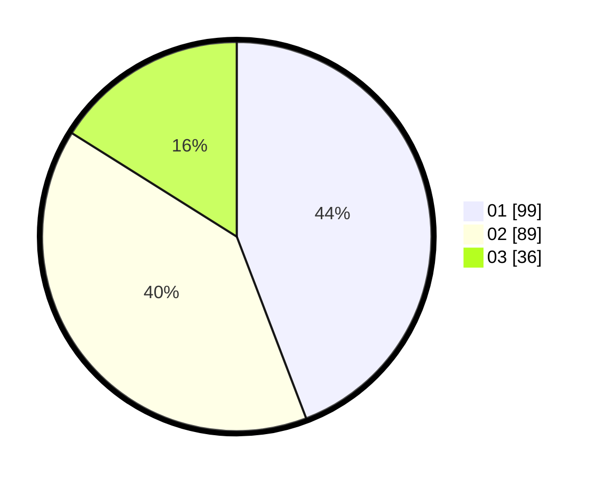

# Hasil

Hasil perolehan suara paslon dapat dilihat pada file paslon-01.txt, paslon-02.txt, dan paslon-03.txt.

Jika tidak ada, artinya data tersebut belum ada pada SIREKAP.

## Perolehan Suara

 * Paslon 01: **99**.
 * Paslon 02: **89**.
 * Paslon 03: **36**.

## Foto C Plano

https://sirekap-obj-formc.kpu.go.id/1de6/pemilu/ppwp/31/71/03/10/06/3171031006003-20240216-190426--32c58154-6ac1-4352-b3cf-f45cd8624e85.jpg

https://sirekap-obj-formc.kpu.go.id/1de6/pemilu/ppwp/31/71/03/10/06/3171031006003-20240216-190427--fb44659d-1b6e-4af9-bf13-69fd78b9a146.jpg

https://sirekap-obj-formc.kpu.go.id/1de6/pemilu/ppwp/31/71/03/10/06/3171031006003-20240216-190426--6db1b726-cb7c-4a7f-8512-ab2486dab894.jpg

## DATA PEMILIH TETAP

Jumlah pemilih dalam DPT: **0**.
 * L: **0**.
 * P: **0**.

## DATA PENGGUNA HAK PILIH

Jumlah pengguna hak pilih dalam DPT: **222**.
 * L: **98**.
 * P: **124**.

Jumlah pengguna hak pilih dalam DPTb: **2**.
 * L: **2**.
 * P: **0**.

Jumlah pengguna hak pilih dalam DPK: **1**.
 * L: **1**.
 * P: **0**.

Jumlah pengguna hak pilih: **225**.
 * L: **101**.
 * P: **124**.

## JUMLAH SUARA SAH DAN TIDAK SAH

JUMLAH SELURUH SUARA SAH: **224**.

JUMLAH SUARA TIDAK SAH: **1**.

JUMLAH SELURUH SUARA SAH DAN SUARA TIDAK SAH: **225**.
