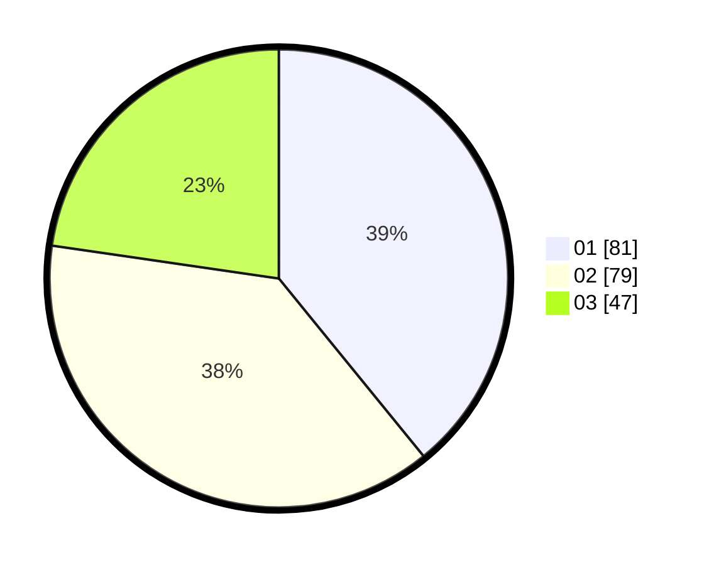

# Hasil

Hasil perolehan suara paslon dapat dilihat pada file paslon-01.txt, paslon-02.txt, dan paslon-03.txt.

Jika tidak ada, artinya data tersebut belum ada pada SIREKAP.

## Perolehan Suara

 * Paslon 01: **81**.
 * Paslon 02: **79**.
 * Paslon 03: **47**.

## Foto C Plano

https://sirekap-obj-formc.kpu.go.id/48d7/pemilu/ppwp/31/71/03/10/06/3171031006005-20240216-151714--75e73653-6012-4629-adf9-d12792983995.jpg

https://sirekap-obj-formc.kpu.go.id/48d7/pemilu/ppwp/31/71/03/10/06/3171031006005-20240216-151715--d057ef83-b16b-4517-8dc9-7769d86e9d79.jpg

https://sirekap-obj-formc.kpu.go.id/48d7/pemilu/ppwp/31/71/03/10/06/3171031006005-20240216-151715--55dfefe8-bc7a-4f72-868c-ad67dbd6afdf.jpg

## DATA PEMILIH TETAP

Jumlah pemilih dalam DPT: **285**.
 * L: **148**.
 * P: **137**.

## DATA PENGGUNA HAK PILIH

Jumlah pengguna hak pilih dalam DPT: **210**.
 * L: **103**.
 * P: **107**.

Jumlah pengguna hak pilih dalam DPTb: **0**.
 * L: **0**.
 * P: **0**.

Jumlah pengguna hak pilih dalam DPK: **0**.
 * L: **0**.
 * P: **0**.

Jumlah pengguna hak pilih: **210**.
 * L: **103**.
 * P: **107**.

## JUMLAH SUARA SAH DAN TIDAK SAH

JUMLAH SELURUH SUARA SAH: **207**.

JUMLAH SUARA TIDAK SAH: **3**.

JUMLAH SELURUH SUARA SAH DAN SUARA TIDAK SAH: **210**.
