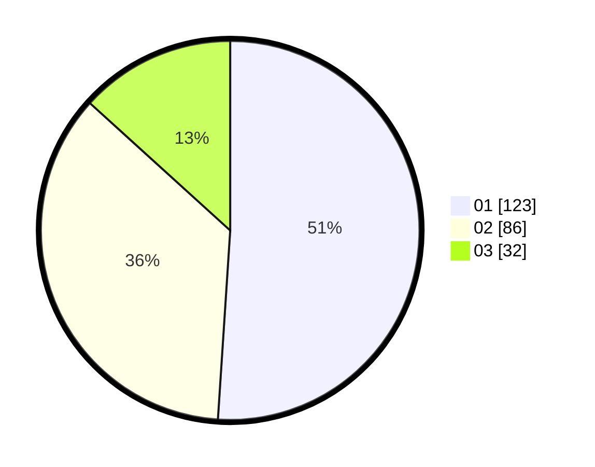

# Hasil

Hasil perolehan suara paslon dapat dilihat pada file paslon-01.txt, paslon-02.txt, dan paslon-03.txt.

Jika tidak ada, artinya data tersebut belum ada pada SIREKAP.

## Perolehan Suara

 * Paslon 01: **123**.
 * Paslon 02: **86**.
 * Paslon 03: **32**.

## Foto C Plano

https://sirekap-obj-formc.kpu.go.id/0c60/pemilu/ppwp/31/71/03/10/06/3171031006006-20240216-121905--368dceeb-70b4-445d-89c9-403438c453d8.jpg

https://sirekap-obj-formc.kpu.go.id/0c60/pemilu/ppwp/31/71/03/10/06/3171031006006-20240216-121909--5ca2a0b3-a043-423e-949c-7f57e059b1f8.jpg

https://sirekap-obj-formc.kpu.go.id/0c60/pemilu/ppwp/31/71/03/10/06/3171031006006-20240216-121906--41f7d7d5-9f26-46c6-b961-7440b8943730.jpg

## DATA PEMILIH TETAP

Jumlah pemilih dalam DPT: **297**.
 * L: **149**.
 * P: **148**.

## DATA PENGGUNA HAK PILIH

Jumlah pengguna hak pilih dalam DPT: **244**.
 * L: **118**.
 * P: **126**.

Jumlah pengguna hak pilih dalam DPTb: **0**.
 * L: **0**.
 * P: **0**.

Jumlah pengguna hak pilih dalam DPK: **2**.
 * L: **2**.
 * P: **0**.

Jumlah pengguna hak pilih: **246**.
 * L: **120**.
 * P: **126**.

## JUMLAH SUARA SAH DAN TIDAK SAH

JUMLAH SELURUH SUARA SAH: **241**.

JUMLAH SUARA TIDAK SAH: **5**.

JUMLAH SELURUH SUARA SAH DAN SUARA TIDAK SAH: **246**.
