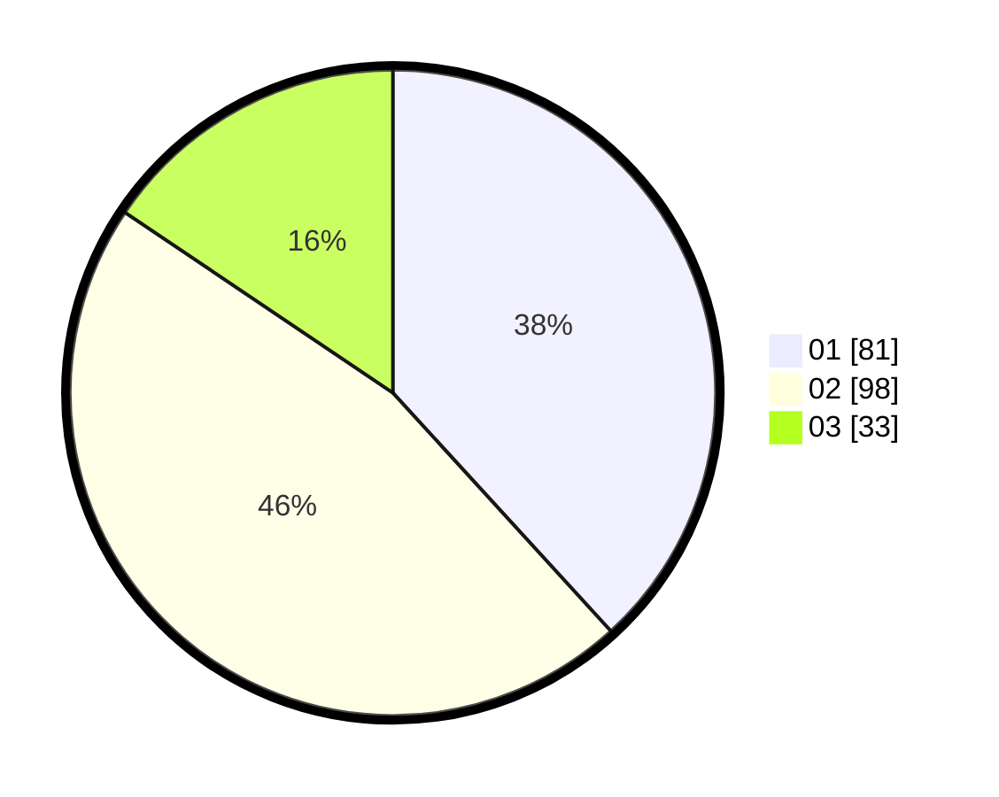

# Hasil

Hasil perolehan suara paslon dapat dilihat pada file paslon-01.txt, paslon-02.txt, dan paslon-03.txt.

Jika tidak ada, artinya data tersebut belum ada pada SIREKAP.

## Perolehan Suara

 * Paslon 01: **81**.
 * Paslon 02: **98**.
 * Paslon 03: **33**.

## Foto C Plano

https://sirekap-obj-formc.kpu.go.id/b58a/pemilu/ppwp/31/71/03/10/06/3171031006010-20240216-144542--2b647079-81b3-4f6c-acb5-85ce5561eab9.jpg

https://sirekap-obj-formc.kpu.go.id/b58a/pemilu/ppwp/31/71/03/10/06/3171031006010-20240216-144543--2289caea-3402-428d-a2b7-994e72c30449.jpg

https://sirekap-obj-formc.kpu.go.id/b58a/pemilu/ppwp/31/71/03/10/06/3171031006010-20240216-144542--55e91e8f-cb1b-4c7d-8f18-a5bf9a196085.jpg

## DATA PEMILIH TETAP

Jumlah pemilih dalam DPT: **282**.
 * L: **139**.
 * P: **143**.

## DATA PENGGUNA HAK PILIH

Jumlah pengguna hak pilih dalam DPT: **216**.
 * L: **103**.
 * P: **113**.

Jumlah pengguna hak pilih dalam DPTb: **0**.
 * L: **0**.
 * P: **0**.

Jumlah pengguna hak pilih dalam DPK: **0**.
 * L: **0**.
 * P: **0**.

Jumlah pengguna hak pilih: **216**.
 * L: **103**.
 * P: **113**.

## JUMLAH SUARA SAH DAN TIDAK SAH

JUMLAH SELURUH SUARA SAH: **212**.

JUMLAH SUARA TIDAK SAH: **4**.

JUMLAH SELURUH SUARA SAH DAN SUARA TIDAK SAH: **216**.
