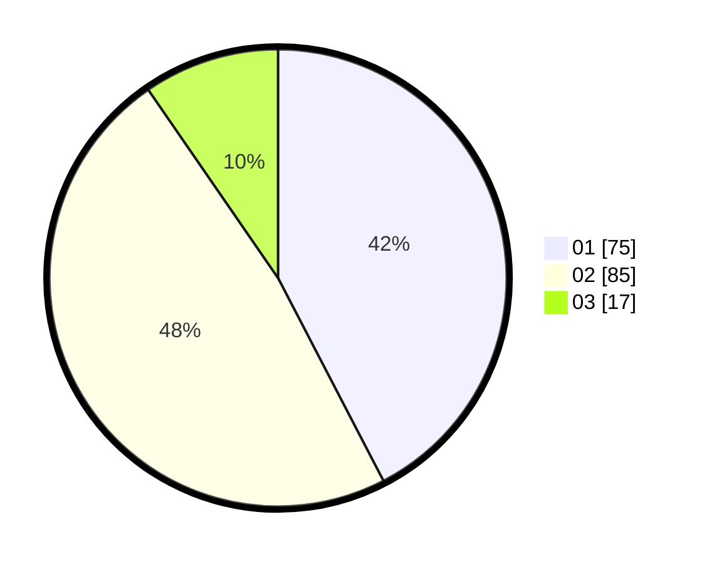

# Hasil

Hasil perolehan suara paslon dapat dilihat pada file paslon-01.txt, paslon-02.txt, dan paslon-03.txt.

Jika tidak ada, artinya data tersebut belum ada pada SIREKAP.

## Perolehan Suara

 * Paslon 01: **75**.
 * Paslon 02: **85**.
 * Paslon 03: **17**.

## Foto C Plano

https://sirekap-obj-formc.kpu.go.id/7428/pemilu/ppwp/31/71/03/10/06/3171031006013-20240214-204953--65dcb8a6-e0a9-4bcf-8c05-4a3c59319732.jpg

https://sirekap-obj-formc.kpu.go.id/7428/pemilu/ppwp/31/71/03/10/06/3171031006013-20240214-204527--29c3eb35-9eb3-413d-ac4d-5f04b6254933.jpg

https://sirekap-obj-formc.kpu.go.id/7428/pemilu/ppwp/31/71/03/10/06/3171031006013-20240214-205121--bb441964-e292-4572-b159-0eec4deb6e3c.jpg

## DATA PEMILIH TETAP

Jumlah pemilih dalam DPT: **271**.
 * L: **139**.
 * P: **132**.

## DATA PENGGUNA HAK PILIH

Jumlah pengguna hak pilih dalam DPT: **176**.
 * L: **84**.
 * P: **92**.

Jumlah pengguna hak pilih dalam DPTb: **5**.
 * L: **4**.
 * P: **1**.

Jumlah pengguna hak pilih dalam DPK: **1**.
 * L: **0**.
 * P: **1**.

Jumlah pengguna hak pilih: **182**.
 * L: **88**.
 * P: **94**.

## JUMLAH SUARA SAH DAN TIDAK SAH

JUMLAH SELURUH SUARA SAH: **177**.

JUMLAH SUARA TIDAK SAH: **5**.

JUMLAH SELURUH SUARA SAH DAN SUARA TIDAK SAH: **182**.
