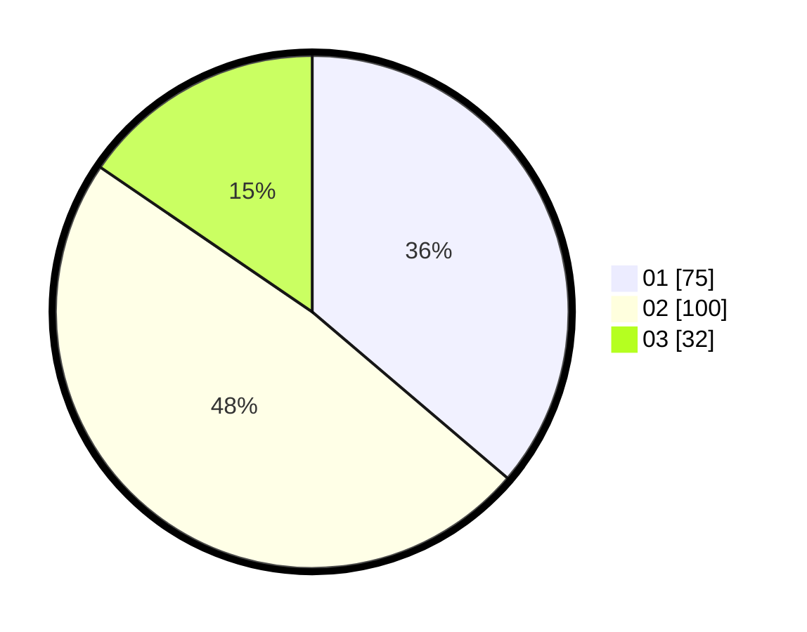

# Hasil

Hasil perolehan suara paslon dapat dilihat pada file paslon-01.txt, paslon-02.txt, dan paslon-03.txt.

Jika tidak ada, artinya data tersebut belum ada pada SIREKAP.

## Perolehan Suara

 * Paslon 01: **75**.
 * Paslon 02: **100**.
 * Paslon 03: **32**.

## Foto C Plano

https://sirekap-obj-formc.kpu.go.id/2c90/pemilu/ppwp/31/71/03/10/06/3171031006014-20240215-193201--d4efde46-cf43-4666-a179-d84c55c83c4f.jpg

https://sirekap-obj-formc.kpu.go.id/2c90/pemilu/ppwp/31/71/03/10/06/3171031006014-20240215-193223--034cfa08-857e-4243-87fa-dd51f28fd55c.jpg

https://sirekap-obj-formc.kpu.go.id/2c90/pemilu/ppwp/31/71/03/10/06/3171031006014-20240215-193212--c6170ec7-1dae-4406-8bf2-e0f31310dbf0.jpg

## DATA PEMILIH TETAP

Jumlah pemilih dalam DPT: **284**.
 * L: **145**.
 * P: **139**.

## DATA PENGGUNA HAK PILIH

Jumlah pengguna hak pilih dalam DPT: **203**.
 * L: **98**.
 * P: **105**.

Jumlah pengguna hak pilih dalam DPTb: **6**.
 * L: **1**.
 * P: **5**.

Jumlah pengguna hak pilih dalam DPK: **0**.
 * L: **0**.
 * P: **0**.

Jumlah pengguna hak pilih: **209**.
 * L: **99**.
 * P: **110**.

## JUMLAH SUARA SAH DAN TIDAK SAH

JUMLAH SELURUH SUARA SAH: **207**.

JUMLAH SUARA TIDAK SAH: **2**.

JUMLAH SELURUH SUARA SAH DAN SUARA TIDAK SAH: **209**.
