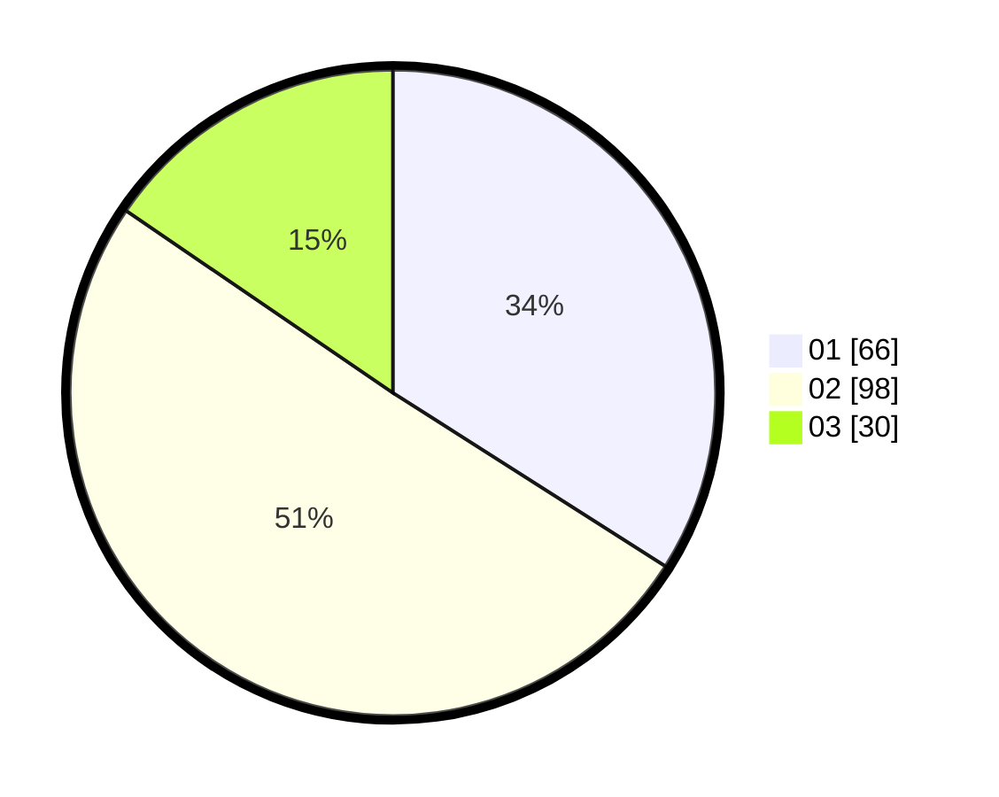

# Hasil

Hasil perolehan suara paslon dapat dilihat pada file paslon-01.txt, paslon-02.txt, dan paslon-03.txt.

Jika tidak ada, artinya data tersebut belum ada pada SIREKAP.

## Perolehan Suara

 * Paslon 01: **66**.
 * Paslon 02: **98**.
 * Paslon 03: **30**.

## Foto C Plano

https://sirekap-obj-formc.kpu.go.id/4909/pemilu/ppwp/31/71/03/10/06/3171031006019-20240216-032442--9f6fd954-cb84-471c-ad8f-7ca8316079be.jpg

https://sirekap-obj-formc.kpu.go.id/4909/pemilu/ppwp/31/71/03/10/06/3171031006019-20240216-034329--99a71d12-a4a5-4656-b696-950b486817f3.jpg

https://sirekap-obj-formc.kpu.go.id/4909/pemilu/ppwp/31/71/03/10/06/3171031006019-20240216-032445--f90e0d56-9a88-4702-b78b-81109bfb4b24.jpg

## DATA PEMILIH TETAP

Jumlah pemilih dalam DPT: **282**.
 * L: **134**.
 * P: **148**.

## DATA PENGGUNA HAK PILIH

Jumlah pengguna hak pilih dalam DPT: **193**.
 * L: **86**.
 * P: **107**.

Jumlah pengguna hak pilih dalam DPTb: **4**.
 * L: **2**.
 * P: **2**.

Jumlah pengguna hak pilih dalam DPK: **0**.
 * L: **0**.
 * P: **0**.

Jumlah pengguna hak pilih: **197**.
 * L: **88**.
 * P: **109**.

## JUMLAH SUARA SAH DAN TIDAK SAH

JUMLAH SELURUH SUARA SAH: **194**.

JUMLAH SUARA TIDAK SAH: **3**.

JUMLAH SELURUH SUARA SAH DAN SUARA TIDAK SAH: **197**.
