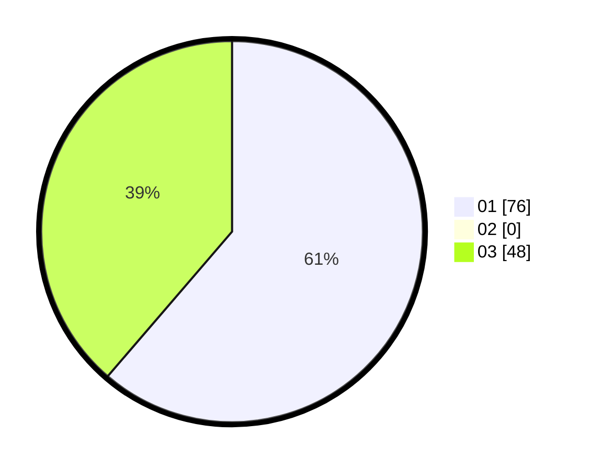

# Hasil

Hasil perolehan suara paslon dapat dilihat pada file paslon-01.txt, paslon-02.txt, dan paslon-03.txt.

Jika tidak ada, artinya data tersebut belum ada pada SIREKAP.

## Perolehan Suara

 * Paslon 01: **76**.
 * Paslon 02: **0**.
 * Paslon 03: **48**.

## Foto C Plano

https://sirekap-obj-formc.kpu.go.id/a5f7/pemilu/ppwp/31/71/03/10/06/3171031006023-20240214-190937--1c65e424-917e-4e4a-a6b6-2b19aa8bc935.jpg

https://sirekap-obj-formc.kpu.go.id/a5f7/pemilu/ppwp/31/71/03/10/06/3171031006023-20240214-190950--500ac72e-06f7-4979-9509-430aad9435af.jpg

https://sirekap-obj-formc.kpu.go.id/a5f7/pemilu/ppwp/31/71/03/10/06/3171031006023-20240214-200825--cbb89bee-4763-45e1-8a53-79d467381530.jpg

## DATA PEMILIH TETAP

Jumlah pemilih dalam DPT: **211**.
 * L: **123**.
 * P: **88**.

## DATA PENGGUNA HAK PILIH

Jumlah pengguna hak pilih dalam DPT: **211**.
 * L: **123**.
 * P: **88**.

Jumlah pengguna hak pilih dalam DPTb: **4**.
 * L: **1**.
 * P: **3**.

Jumlah pengguna hak pilih dalam DPK: **2**.
 * L: **0**.
 * P: **2**.

Jumlah pengguna hak pilih: **217**.
 * L: **124**.
 * P: **93**.

## JUMLAH SUARA SAH DAN TIDAK SAH

JUMLAH SELURUH SUARA SAH: **212**.

JUMLAH SUARA TIDAK SAH: **5**.

JUMLAH SELURUH SUARA SAH DAN SUARA TIDAK SAH: **217**.
