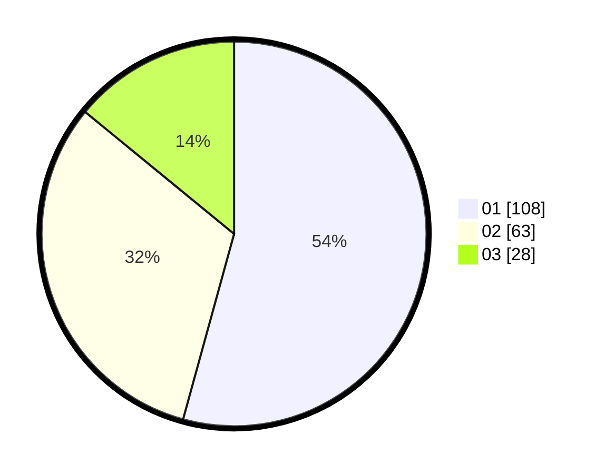

# Hasil

Hasil perolehan suara paslon dapat dilihat pada file paslon-01.txt, paslon-02.txt, dan paslon-03.txt.

Jika tidak ada, artinya data tersebut belum ada pada SIREKAP.

## Perolehan Suara

 * Paslon 01: **108**.
 * Paslon 02: **63**.
 * Paslon 03: **28**.

## Foto C Plano

https://sirekap-obj-formc.kpu.go.id/5fef/pemilu/ppwp/31/71/03/10/06/3171031006027-20240214-162229--8289359d-7829-44ea-a5ee-6cd7539f21b5.jpg

https://sirekap-obj-formc.kpu.go.id/5fef/pemilu/ppwp/31/71/03/10/06/3171031006027-20240214-185213--00d088f6-9983-459e-8ec5-21e6a287071e.jpg

https://sirekap-obj-formc.kpu.go.id/5fef/pemilu/ppwp/31/71/03/10/06/3171031006027-20240214-185223--739b6e61-4bef-45c3-b7bb-bc2df06b3c28.jpg

## DATA PEMILIH TETAP

Jumlah pemilih dalam DPT: **271**.
 * L: **133**.
 * P: **138**.

## DATA PENGGUNA HAK PILIH

Jumlah pengguna hak pilih dalam DPT: **207**.
 * L: **94**.
 * P: **113**.

Jumlah pengguna hak pilih dalam DPTb: **0**.
 * L: **0**.
 * P: **0**.

Jumlah pengguna hak pilih dalam DPK: **0**.
 * L: **0**.
 * P: **0**.

Jumlah pengguna hak pilih: **207**.
 * L: **94**.
 * P: **113**.

## JUMLAH SUARA SAH DAN TIDAK SAH

JUMLAH SELURUH SUARA SAH: **199**.

JUMLAH SUARA TIDAK SAH: **8**.

JUMLAH SELURUH SUARA SAH DAN SUARA TIDAK SAH: **207**.
