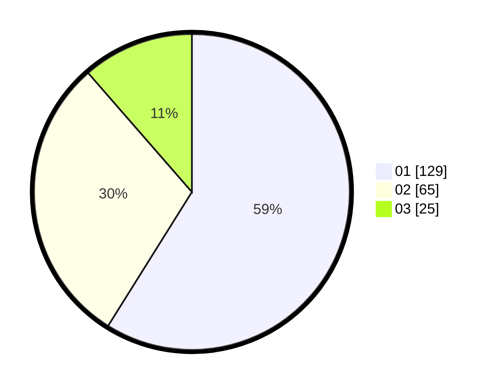

# Hasil

Hasil perolehan suara paslon dapat dilihat pada file paslon-01.txt, paslon-02.txt, dan paslon-03.txt.

Jika tidak ada, artinya data tersebut belum ada pada SIREKAP.

## Perolehan Suara

 * Paslon 01: **129**.
 * Paslon 02: **65**.
 * Paslon 03: **25**.

## Foto C Plano

https://sirekap-obj-formc.kpu.go.id/e46b/pemilu/ppwp/31/71/03/10/06/3171031006029-20240214-232930--c088302a-bead-4c22-8fbc-cd329ead4823.jpg

https://sirekap-obj-formc.kpu.go.id/e46b/pemilu/ppwp/31/71/03/10/06/3171031006029-20240215-014107--f9ea6037-5ac6-432b-8d89-105b73e7d990.jpg

https://sirekap-obj-formc.kpu.go.id/e46b/pemilu/ppwp/31/71/03/10/06/3171031006029-20240215-014229--81d49ca4-812c-4131-8b03-97d8b79f6df5.jpg

## DATA PEMILIH TETAP

Jumlah pemilih dalam DPT: **212**.
 * L: **105**.
 * P: **107**.

## DATA PENGGUNA HAK PILIH

Jumlah pengguna hak pilih dalam DPT: **212**.
 * L: **105**.
 * P: **107**.

Jumlah pengguna hak pilih dalam DPTb: **9**.
 * L: **5**.
 * P: **4**.

Jumlah pengguna hak pilih dalam DPK: **1**.
 * L: **1**.
 * P: **0**.

Jumlah pengguna hak pilih: **222**.
 * L: **111**.
 * P: **111**.

## JUMLAH SUARA SAH DAN TIDAK SAH

JUMLAH SELURUH SUARA SAH: **219**.

JUMLAH SUARA TIDAK SAH: **3**.

JUMLAH SELURUH SUARA SAH DAN SUARA TIDAK SAH: **222**.
