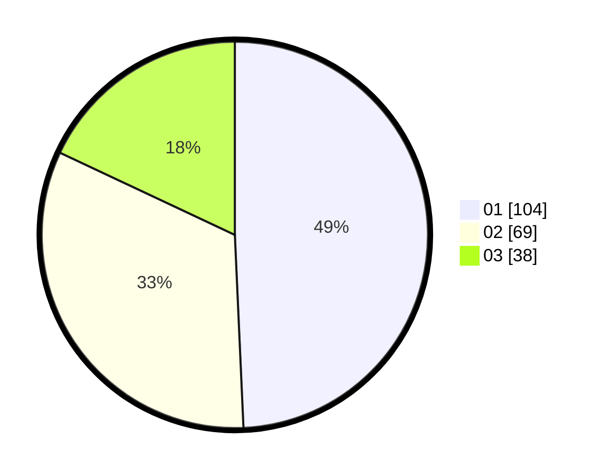

# Hasil

Hasil perolehan suara paslon dapat dilihat pada file paslon-01.txt, paslon-02.txt, dan paslon-03.txt.

Jika tidak ada, artinya data tersebut belum ada pada SIREKAP.

## Perolehan Suara

 * Paslon 01: **104**.
 * Paslon 02: **69**.
 * Paslon 03: **38**.

## Foto C Plano

https://sirekap-obj-formc.kpu.go.id/af23/pemilu/ppwp/31/71/03/10/06/3171031006031-20240215-073230--2c4b1654-0819-4a6d-897b-f6b10e8073af.jpg

https://sirekap-obj-formc.kpu.go.id/af23/pemilu/ppwp/31/71/03/10/06/3171031006031-20240215-073323--5cd2f2b8-b4f5-4625-a7cd-90c1b693c2ec.jpg

https://sirekap-obj-formc.kpu.go.id/af23/pemilu/ppwp/31/71/03/10/06/3171031006031-20240215-073427--fe2a3128-b926-47f5-aad8-ce58d999a840.jpg

## DATA PEMILIH TETAP

Jumlah pemilih dalam DPT: **265**.
 * L: **124**.
 * P: **141**.

## DATA PENGGUNA HAK PILIH

Jumlah pengguna hak pilih dalam DPT: **207**.
 * L: **96**.
 * P: **111**.

Jumlah pengguna hak pilih dalam DPTb: **1**.
 * L: **0**.
 * P: **1**.

Jumlah pengguna hak pilih dalam DPK: **4**.
 * L: **2**.
 * P: **2**.

Jumlah pengguna hak pilih: **212**.
 * L: **98**.
 * P: **114**.

## JUMLAH SUARA SAH DAN TIDAK SAH

JUMLAH SELURUH SUARA SAH: **211**.

JUMLAH SUARA TIDAK SAH: **1**.

JUMLAH SELURUH SUARA SAH DAN SUARA TIDAK SAH: **212**.
