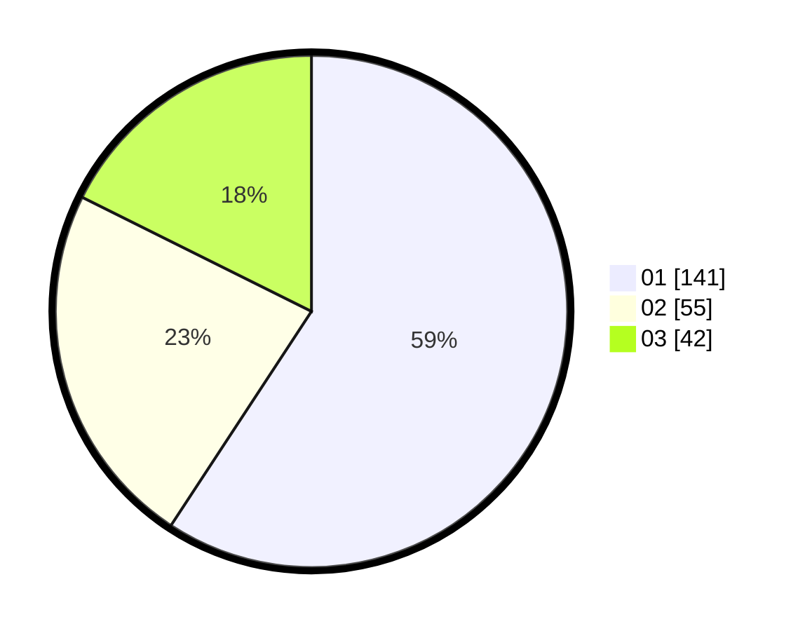

# Hasil

Hasil perolehan suara paslon dapat dilihat pada file paslon-01.txt, paslon-02.txt, dan paslon-03.txt.

Jika tidak ada, artinya data tersebut belum ada pada SIREKAP.

## Perolehan Suara

 * Paslon 01: **141**.
 * Paslon 02: **55**.
 * Paslon 03: **42**.

## Foto C Plano

https://sirekap-obj-formc.kpu.go.id/ebfd/pemilu/ppwp/31/71/03/10/06/3171031006033-20240217-205625--5cd047c1-4911-444a-9462-190b911718d2.jpg

https://sirekap-obj-formc.kpu.go.id/ebfd/pemilu/ppwp/31/71/03/10/06/3171031006033-20240217-224915--e6c2140e-cb55-4120-a20e-9e6cba009124.jpg

https://sirekap-obj-formc.kpu.go.id/ebfd/pemilu/ppwp/31/71/03/10/06/3171031006033-20240217-224914--f8c106e1-bcd6-44b5-8ee2-24eccabef533.jpg

## DATA PEMILIH TETAP

Jumlah pemilih dalam DPT: **236**.
 * L: **108**.
 * P: **128**.

## DATA PENGGUNA HAK PILIH

Jumlah pengguna hak pilih dalam DPT: **236**.
 * L: **108**.
 * P: **128**.

Jumlah pengguna hak pilih dalam DPTb: **1**.
 * L: **1**.
 * P: **0**.

Jumlah pengguna hak pilih dalam DPK: **3**.
 * L: **1**.
 * P: **2**.

Jumlah pengguna hak pilih: **240**.
 * L: **110**.
 * P: **130**.

## JUMLAH SUARA SAH DAN TIDAK SAH

JUMLAH SELURUH SUARA SAH: **238**.

JUMLAH SUARA TIDAK SAH: **2**.

JUMLAH SELURUH SUARA SAH DAN SUARA TIDAK SAH: **240**.
