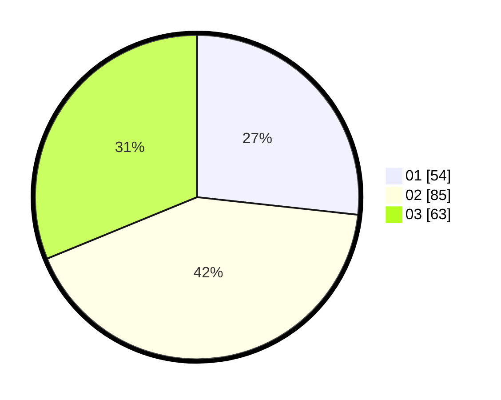

# Hasil

Hasil perolehan suara paslon dapat dilihat pada file paslon-01.txt, paslon-02.txt, dan paslon-03.txt.

Jika tidak ada, artinya data tersebut belum ada pada SIREKAP.

## Perolehan Suara

 * Paslon 01: **54**.
 * Paslon 02: **85**.
 * Paslon 03: **63**.

## Foto C Plano

https://sirekap-obj-formc.kpu.go.id/347c/pemilu/ppwp/31/71/03/10/06/3171031006034-20240214-222244--e6c4bbdf-b9f1-4614-a319-67eca8adf89d.jpg

https://sirekap-obj-formc.kpu.go.id/347c/pemilu/ppwp/31/71/03/10/06/3171031006034-20240214-222405--30a96696-82a8-488a-ac6e-7ce0abc9b49f.jpg

https://sirekap-obj-formc.kpu.go.id/347c/pemilu/ppwp/31/71/03/10/06/3171031006034-20240214-222349--c980d405-40f8-4dff-813c-0a81b1b352e6.jpg

## DATA PEMILIH TETAP

Jumlah pemilih dalam DPT: **259**.
 * L: **136**.
 * P: **259**.

## DATA PENGGUNA HAK PILIH

Jumlah pengguna hak pilih dalam DPT: **189**.
 * L: **97**.
 * P: **92**.

Jumlah pengguna hak pilih dalam DPTb: **10**.
 * L: **2**.
 * P: **8**.

Jumlah pengguna hak pilih dalam DPK: **3**.
 * L: **0**.
 * P: **3**.

Jumlah pengguna hak pilih: **202**.
 * L: **99**.
 * P: **103**.

## JUMLAH SUARA SAH DAN TIDAK SAH

JUMLAH SELURUH SUARA SAH: **202**.

JUMLAH SUARA TIDAK SAH: **0**.

JUMLAH SELURUH SUARA SAH DAN SUARA TIDAK SAH: **202**.
