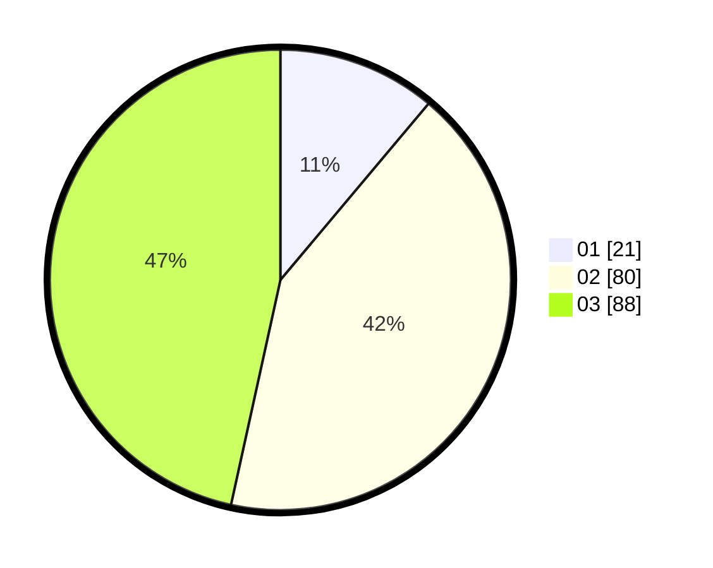

# Hasil

Hasil perolehan suara paslon dapat dilihat pada file paslon-01.txt, paslon-02.txt, dan paslon-03.txt.

Jika tidak ada, artinya data tersebut belum ada pada SIREKAP.

## Perolehan Suara

 * Paslon 01: **21**.
 * Paslon 02: **80**.
 * Paslon 03: **88**.

## Foto C Plano

https://sirekap-obj-formc.kpu.go.id/aefc/pemilu/ppwp/31/71/03/10/06/3171031006035-20240214-233606--5cf24b16-296b-4e68-8c74-f1b72e8821d6.jpg

https://sirekap-obj-formc.kpu.go.id/aefc/pemilu/ppwp/31/71/03/10/06/3171031006035-20240216-091029--596b1993-48d3-46fd-a631-71eeb339c7e6.jpg

https://sirekap-obj-formc.kpu.go.id/aefc/pemilu/ppwp/31/71/03/10/06/3171031006035-20240216-093840--c758c32a-a069-42d0-b1f2-19fdce953cf3.jpg

## DATA PEMILIH TETAP

Jumlah pemilih dalam DPT: **262**.
 * L: **126**.
 * P: **136**.

## DATA PENGGUNA HAK PILIH

Jumlah pengguna hak pilih dalam DPT: **191**.
 * L: **88**.
 * P: **103**.

Jumlah pengguna hak pilih dalam DPTb: **4**.
 * L: **1**.
 * P: **3**.

Jumlah pengguna hak pilih dalam DPK: **0**.
 * L: **0**.
 * P: **0**.

Jumlah pengguna hak pilih: **195**.
 * L: **89**.
 * P: **106**.

## JUMLAH SUARA SAH DAN TIDAK SAH

JUMLAH SELURUH SUARA SAH: **189**.

JUMLAH SUARA TIDAK SAH: **6**.

JUMLAH SELURUH SUARA SAH DAN SUARA TIDAK SAH: **195**.
