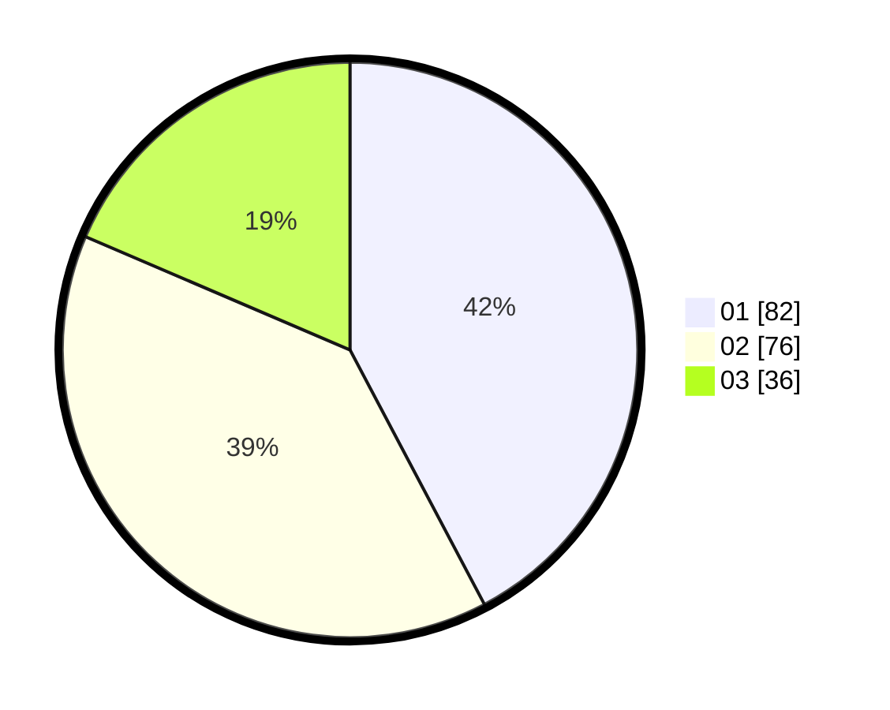

# Hasil

Hasil perolehan suara paslon dapat dilihat pada file paslon-01.txt, paslon-02.txt, dan paslon-03.txt.

Jika tidak ada, artinya data tersebut belum ada pada SIREKAP.

## Perolehan Suara

 * Paslon 01: **82**.
 * Paslon 02: **76**.
 * Paslon 03: **36**.

## Foto C Plano

https://sirekap-obj-formc.kpu.go.id/07d1/pemilu/ppwp/31/71/03/10/06/3171031006036-20240217-010406--f97fbc7c-3236-4780-80f7-c67b229e24d3.jpg

https://sirekap-obj-formc.kpu.go.id/07d1/pemilu/ppwp/31/71/03/10/06/3171031006036-20240217-010408--91af6462-957c-4faf-a28e-d642a8bfb8e0.jpg

https://sirekap-obj-formc.kpu.go.id/07d1/pemilu/ppwp/31/71/03/10/06/3171031006036-20240217-010407--ff8948e4-8bfe-40ae-a80b-2f5ff80ba56e.jpg

## DATA PEMILIH TETAP

Jumlah pemilih dalam DPT: **272**.
 * L: **126**.
 * P: **146**.

## DATA PENGGUNA HAK PILIH

Jumlah pengguna hak pilih dalam DPT: **187**.
 * L: **81**.
 * P: **106**.

Jumlah pengguna hak pilih dalam DPTb: **8**.
 * L: **1**.
 * P: **7**.

Jumlah pengguna hak pilih dalam DPK: **4**.
 * L: **2**.
 * P: **2**.

Jumlah pengguna hak pilih: **199**.
 * L: **84**.
 * P: **115**.

## JUMLAH SUARA SAH DAN TIDAK SAH

JUMLAH SELURUH SUARA SAH: **194**.

JUMLAH SUARA TIDAK SAH: **5**.

JUMLAH SELURUH SUARA SAH DAN SUARA TIDAK SAH: **199**.
