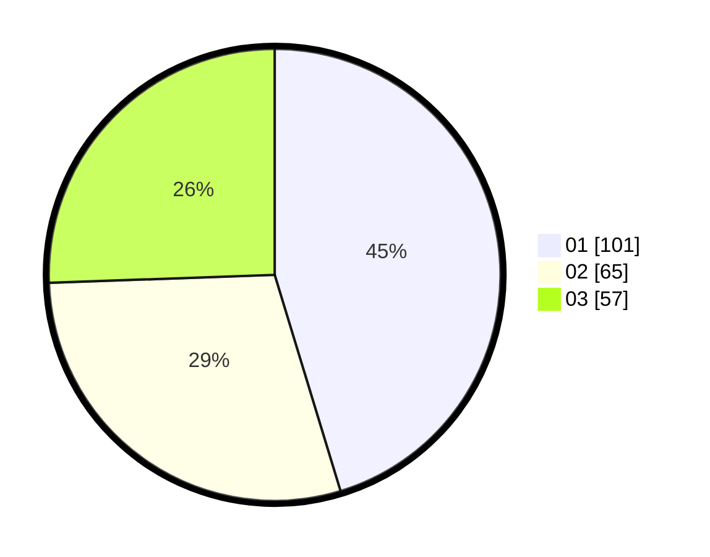

# Hasil

Hasil perolehan suara paslon dapat dilihat pada file paslon-01.txt, paslon-02.txt, dan paslon-03.txt.

Jika tidak ada, artinya data tersebut belum ada pada SIREKAP.

## Perolehan Suara

 * Paslon 01: **101**.
 * Paslon 02: **65**.
 * Paslon 03: **57**.

## Foto C Plano

https://sirekap-obj-formc.kpu.go.id/f838/pemilu/ppwp/31/71/03/10/06/3171031006037-20240214-191157--f2696ba1-b8a6-488d-a7d6-74ba8355d543.jpg

https://sirekap-obj-formc.kpu.go.id/f838/pemilu/ppwp/31/71/03/10/06/3171031006037-20240215-073626--5afe7903-a7ab-48c4-904f-c8b7bf579d51.jpg

https://sirekap-obj-formc.kpu.go.id/f838/pemilu/ppwp/31/71/03/10/06/3171031006037-20240214-185353--c3e05d16-c5c9-4c0f-a8dc-1343f9dad296.jpg

## DATA PEMILIH TETAP

Jumlah pemilih dalam DPT: **280**.
 * L: **143**.
 * P: **137**.

## DATA PENGGUNA HAK PILIH

Jumlah pengguna hak pilih dalam DPT: **224**.
 * L: **108**.
 * P: **116**.

Jumlah pengguna hak pilih dalam DPTb: **3**.
 * L: **1**.
 * P: **2**.

Jumlah pengguna hak pilih dalam DPK: **0**.
 * L: **0**.
 * P: **0**.

Jumlah pengguna hak pilih: **227**.
 * L: **109**.
 * P: **118**.

## JUMLAH SUARA SAH DAN TIDAK SAH

JUMLAH SELURUH SUARA SAH: **223**.

JUMLAH SUARA TIDAK SAH: **4**.

JUMLAH SELURUH SUARA SAH DAN SUARA TIDAK SAH: **227**.
