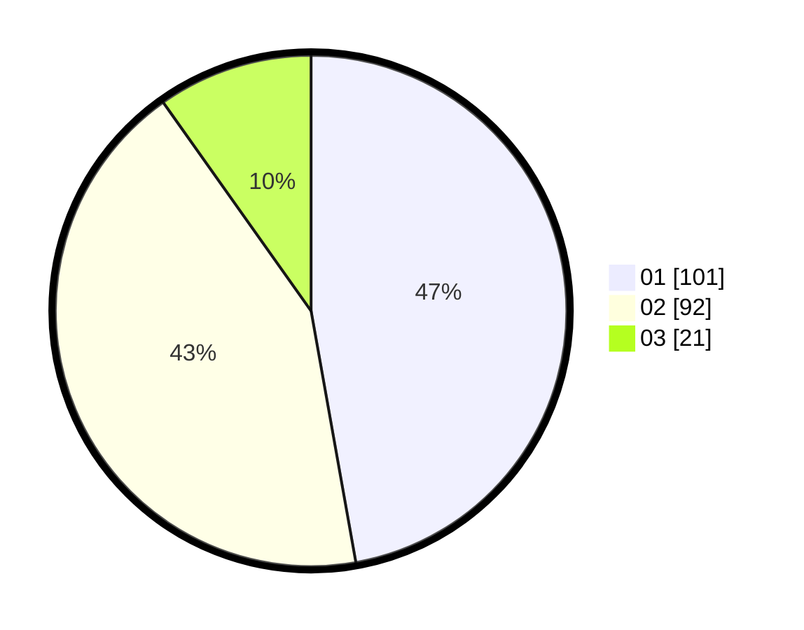

# Hasil

Hasil perolehan suara paslon dapat dilihat pada file paslon-01.txt, paslon-02.txt, dan paslon-03.txt.

Jika tidak ada, artinya data tersebut belum ada pada SIREKAP.

## Perolehan Suara

 * Paslon 01: **101**.
 * Paslon 02: **92**.
 * Paslon 03: **21**.

## Foto C Plano

https://sirekap-obj-formc.kpu.go.id/421e/pemilu/ppwp/31/71/03/10/06/3171031006042-20240216-042715--ad7fa25b-bf19-4ae8-b1a6-3ec2edbb513d.jpg

https://sirekap-obj-formc.kpu.go.id/421e/pemilu/ppwp/31/71/03/10/06/3171031006042-20240216-054643--3d966dd9-2f80-4644-875c-36743bfd8e59.jpg

https://sirekap-obj-formc.kpu.go.id/421e/pemilu/ppwp/31/71/03/10/06/3171031006042-20240216-053409--e5f1ef57-e574-42e2-82d5-346964aceab7.jpg

## DATA PEMILIH TETAP

Jumlah pemilih dalam DPT: **279**.
 * L: **98**.
 * P: **181**.

## DATA PENGGUNA HAK PILIH

Jumlah pengguna hak pilih dalam DPT: **211**.
 * L: **96**.
 * P: **115**.

Jumlah pengguna hak pilih dalam DPTb: **3**.
 * L: **2**.
 * P: **1**.

Jumlah pengguna hak pilih dalam DPK: **1**.
 * L: **0**.
 * P: **1**.

Jumlah pengguna hak pilih: **215**.
 * L: **98**.
 * P: **117**.

## JUMLAH SUARA SAH DAN TIDAK SAH

JUMLAH SELURUH SUARA SAH: **214**.

JUMLAH SUARA TIDAK SAH: **1**.

JUMLAH SELURUH SUARA SAH DAN SUARA TIDAK SAH: **215**.
