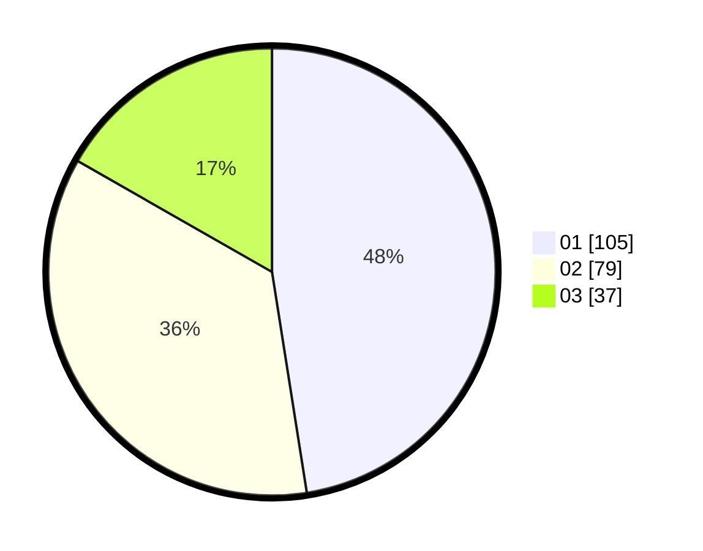

# Hasil

Hasil perolehan suara paslon dapat dilihat pada file paslon-01.txt, paslon-02.txt, dan paslon-03.txt.

Jika tidak ada, artinya data tersebut belum ada pada SIREKAP.

## Perolehan Suara

 * Paslon 01: **105**.
 * Paslon 02: **79**.
 * Paslon 03: **37**.

## Foto C Plano

https://sirekap-obj-formc.kpu.go.id/5638/pemilu/ppwp/31/71/03/10/06/3171031006043-20240214-225621--e3474e5c-bb17-496f-a47f-61269641d672.jpg

https://sirekap-obj-formc.kpu.go.id/5638/pemilu/ppwp/31/71/03/10/06/3171031006043-20240214-225737--2028ae92-a14b-41fb-b3c7-cb24be346bf7.jpg

https://sirekap-obj-formc.kpu.go.id/5638/pemilu/ppwp/31/71/03/10/06/3171031006043-20240214-225836--c428c515-0809-4cdd-bd18-74f2bcba2eaa.jpg

## DATA PEMILIH TETAP

Jumlah pemilih dalam DPT: **279**.
 * L: **146**.
 * P: **133**.

## DATA PENGGUNA HAK PILIH

Jumlah pengguna hak pilih dalam DPT: **219**.
 * L: **116**.
 * P: **103**.

Jumlah pengguna hak pilih dalam DPTb: **1**.
 * L: **1**.
 * P: **0**.

Jumlah pengguna hak pilih dalam DPK: **3**.
 * L: **1**.
 * P: **2**.

Jumlah pengguna hak pilih: **223**.
 * L: **118**.
 * P: **105**.

## JUMLAH SUARA SAH DAN TIDAK SAH

JUMLAH SELURUH SUARA SAH: **221**.

JUMLAH SUARA TIDAK SAH: **2**.

JUMLAH SELURUH SUARA SAH DAN SUARA TIDAK SAH: **223**.
